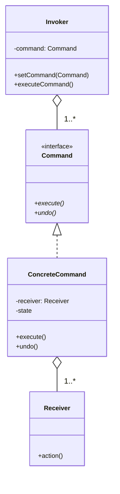

## Was ist das Command Pattern?

Das **Command Pattern** ist ein Verhaltensmuster, das eine Anfrage als Objekt kapselt und somit ermöglicht, Clients mit verschiedenen Anfragen zu parametrisieren, Warteschlangen von Anfragen zu erstellen, und Operationen rückgängig zu machen.

### Kernidee

Kommandos (Befehle) werden als Objekte behandelt. Dadurch können sie gespeichert, weitergegeben, in Warteschlangen gestellt und rückgängig gemacht werden.

## Struktur des Command Patterns



### Komponenten

1. **Command (Interface)**: Definiert die execute() und undo() Methoden
2. **ConcreteCommand**: Implementiert execute() durch Aufruf von Receiver-Methoden
3. **Receiver**: Führt die eigentliche Arbeit aus
4. **Invoker**: Hält und ruft Kommandos auf
5. **Client (Main)**: Erstellt ConcreteCommand-Objekte und setzt deren Receiver

## Vorteile des Command Patterns

- Entkopplung: Anfrage-Sender und -Empfänger sind unabhängig
- Erweiterbarkeit: Neue Kommandos ohne Änderung bestehenden Codes
- Undo/Redo: Rückgängigmachen und Wiederholen möglich
- Makros: Kommandos können zu Sequenzen kombiniert werden
- Warteschlangen: Kommandos können gespeichert und später ausgeführt werden
- Logging: Alle Kommandos können protokolliert werden
- Transaktionen: Atomare Operationen möglich

**Typische Anwendungen:**

- GUI-Buttons und Menüs
- Fernbedienungen
- Thread-Pools und Job-Queues
- Transaktionssysteme
- Editor-Undo/Redo
- Makro-Aufzeichnung

## Beispiel

**Command.java**

```java
public interface Command {
    void execute();
    void undo();
}
```

**Fan.java (Receiver)**

```java
public class Fan {

    public static final int OFF = 0;
    public static final int LOW = 1;
    public static final int MEDIUM = 2;
    public static final int HIGH = 3;

    private int speed = OFF;

    public void low() {
        speed = LOW;
        System.out.println("Ventilator auf LOW");
    }

    public void medium() {
        speed = MEDIUM;
        System.out.println("Ventilator auf MEDIUM");
    }

    public void high() {
        speed = HIGH;
        System.out.println("Ventilator auf HIGH");
    }

    public void off() {
        speed = OFF;
        System.out.println("Ventilator AUS");
    }

    public int getSpeed() {
        return speed;
    }
}
```

**FanLowCommand.java (Concrete Command)**

```java
public class FanLowCommand implements Command {

    private Fan fan;
    private int prevSpeed;

    public FanLowCommand(Fan fan) {
        this.fan = fan;
    }

    @Override
    public void execute() {
        prevSpeed = fan.getSpeed();
        fan.low();
    }

    @Override
    public void undo() {
        restoreSpeed();
    }

    private void restoreSpeed() {
        switch (prevSpeed) {
            case Fan.HIGH -> fan.high();
            case Fan.MEDIUM -> fan.medium();
            case Fan.LOW -> fan.low();
            default -> fan.off();
        }
    }
}
```

**FanMediumCommand.java (Concrete Command)**

```java
public class FanMediumCommand implements Command {

    private Fan fan;
    private int prevSpeed;

    public FanMediumCommand(Fan fan) {
        this.fan = fan;
    }

    @Override
    public void execute() {
        prevSpeed = fan.getSpeed();
        fan.medium();
    }

    @Override
    public void undo() {
        restoreSpeed();
    }

    private void restoreSpeed() {
        switch (prevSpeed) {
            case Fan.HIGH -> fan.high();
            case Fan.MEDIUM -> fan.medium();
            case Fan.LOW -> fan.low();
            default -> fan.off();
        }
    }
}
```

**FanHighCommand.java (Concrete Command)**

```java
public class FanHighCommand implements Command {

    private Fan fan;
    private int prevSpeed;

    public FanHighCommand(Fan fan) {
        this.fan = fan;
    }

    @Override
    public void execute() {
        prevSpeed = fan.getSpeed();
        fan.high();
    }

    @Override
    public void undo() {
        restoreSpeed();
    }

    private void restoreSpeed() {
        switch (prevSpeed) {
            case Fan.HIGH -> fan.high();
            case Fan.MEDIUM -> fan.medium();
            case Fan.LOW -> fan.low();
            default -> fan.off();
        }
    }
}
```

**NoCommand.java**

```java
public class NoCommand implements Command {
    public void execute() {}
    public void undo() {}
}
```

**RemoteControl.java (Invoker mit Stack)**

```java
import java.util.Stack;

public class RemoteControl {

    private Command[] buttons = new Command[3];
    private Stack<Command> undoStack = new Stack<>();

    public RemoteControl() {
        for (int i = 0; i < buttons.length; i++) {
            buttons[i] = new NoCommand();
        }
    }

    public void setCommand(int slot, Command command) {
        buttons[slot] = command;
    }

    public void pressButton(int slot) {
        buttons[slot].execute();
        undoStack.push(buttons[slot]);
    }

    public void pressUndo() {
        if (!undoStack.isEmpty()) {
            undoStack.pop().undo();
        }
    }
}
```

**Client.java**

```java
public class Client {

    public static void main(String[] args) {

        Fan fan = new Fan();

        Command low = new FanLowCommand(fan);
        Command medium = new FanMediumCommand(fan);
        Command high = new FanHighCommand(fan);

        RemoteControl remote = new RemoteControl();
        remote.setCommand(0, low);
        remote.setCommand(1, medium);
        remote.setCommand(2, high);

        remote.pressButton(0); // LOW
        remote.pressButton(2); // HIGH
        remote.pressUndo();    // zurück zu LOW
        remote.pressUndo();    // AUS
    }
}
```

---

**MacroCommand.java** (zusammengefasste Befehle)

```java
public class MacroCommand implements Command {

    private Command[] commands;

    public MacroCommand(Command[] commands) {
        this.commands = commands;
    }

    @Override
    public void execute() {
        for (Command command : commands) {
            command.execute();
        }
    }

    @Override
    public void undo() {
        for (int i = commands.length - 1; i >= 0; i--) {
            commands[i].undo();
        }
    }
}
```

**Client.java (mit Macro Command)**

```java
public class Client {

    public static void main(String[] args) {

        Fan fan = new Fan();

        Command low = new FanLowCommand(fan);
        Command medium = new FanMediumCommand(fan);
        Command high = new FanHighCommand(fan);

        Command partyMode = new MacroCommand(
            new Command[]{ low, medium, high }
        );

        RemoteControl remote = new RemoteControl();
        remote.setCommand(0, low);
        remote.setCommand(1, medium);
        remote.setCommand(2, high);

        remote.pressButton(0); // LOW
        remote.pressButton(1); // MEDIUM
        remote.pressUndo();    // zurück zu LOW

        partyMode.execute();   // LOW → MEDIUM → HIGH
        partyMode.undo();      // rückwärts zurück
    }
}
```
