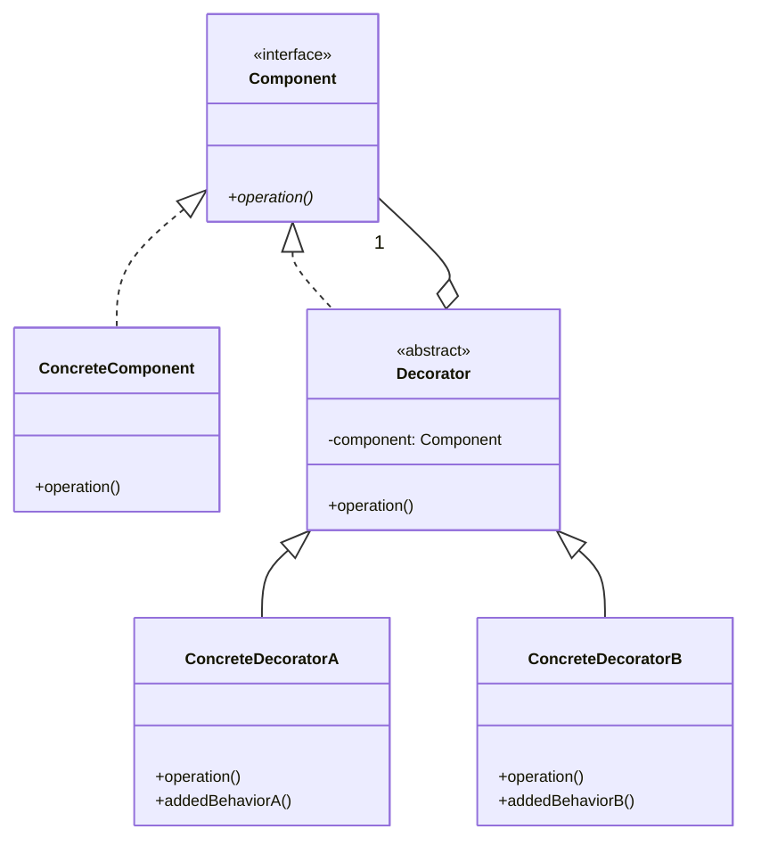
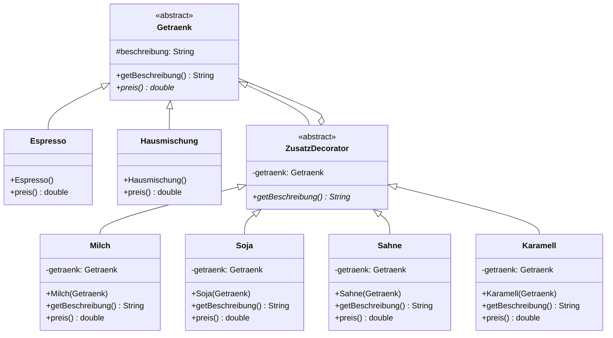

## Was ist das Decorator Pattern?

Das **Decorator Pattern** ist ein Strukturmuster, das es ermöglicht, Objekten dynamisch neue Funktionalität hinzuzufügen, indem sie in spezielle Wrapper-Objekte (Decorators) eingewickelt werden.

### Kernidee

Statt Vererbung für jede Funktionskombination zu verwenden, werden Objekte zur Laufzeit mit zusätzlichen Eigenschaften "dekoriert". Decorators haben die gleiche Schnittstelle wie das dekorierte Objekt.

## Struktur des Decorator Patterns



### Komponenten

1. **Component (Interface)**: Gemeinsame Klasse für Objekte und Decorators. Wenn kein Interface, darf die Basis-Klasse nur Attribute enthalten, die sowohl Decorator wie auch konkrete Komponenten haben.
2. **ConcreteComponent**: Das Basisobjekt, das dekoriert wird
3. **Decorator (Abstract Class)**: Hält eine Referenz auf ein Component-Objekt
4. **ConcreteDecorator**: Fügt neue Funktionalität hinzu


## Vorteile des Decorator Patterns

- Flexible Alternative zur Vererbung: Funktionalität zur Laufzeit hinzufügbar
- Open/Closed Principle: Offen für Erweiterung, geschlossen für Änderung
- Single Responsibility: Jeder Decorator hat eine klare Verantwortung
- Kombinierbar: Decorators können beliebig kombiniert werden
- Keine Klassenexplosion: Vermeidet hunderte Subklassen für alle Kombinationen
- Erweiterbar: Neue Decorators ohne Änderung bestehenden Codes

## Nachteile des Decorator Patterns
- Rekursion (erhöht Laufzeit bei langen Aufrufketten)
- Erschwert Fehlersuche (bei langen Aufrufketten)
- Hohe Objektanzahl

**Typische Anwendungen:**

- Java I/O Streams (BufferedInputStream, DataInputStream)
- GUI-Komponenten (Scrollbars, Rahmen)
- Kaffee-Shop / Pizza-Bestellung
- Formatierung und Kodierung
- Logging und Caching
## Decorator vs. Vererbung

|Decorator Pattern|Vererbung|
|---|---|
|Zur Laufzeit änderbar|Zur Kompilierzeit fest|
|Kombinationen dynamisch|Alle Kombinationen als Klassen|
|Komposition|IS-A Beziehung|
|Wenige Klassen|Klassenexplosion|
|Flexibel|Statisch|
## Decorator vs. Kompositum
| Decorator | Kompositum |
|----------|------------|
| Referenz auf Komponente | Referenz auf Komponente |
| Rekursive Objektstrukturen | Rekursive Objektstrukturen |
| Objekte werden auf dieselbe Art und Weise behandelt | Objekte werden auf dieselbe Art und Weise behandelt |
| Kompositionsbeziehung wird über den Konstruktor aufgebaut | Komponenten werden im Normalfall über eine **add**-Methode hinzugefügt. Eine Übergabe von Komponenten im Konstruktor ist optional |


## Beispiel Klassenexplosion

**Mit Vererbung:**

```
Kaffee
├── KaffeeMitMilch
├── KaffeeMitZucker
├── KaffeeMitMilchUndZucker
├── KaffeeMitSahne
├── KaffeeMitMilchUndSahne
├── KaffeeMitZuckerUndSahne
└── KaffeeMitMilchZuckerUndSahne
```

**Mit Decorator Pattern:**

```
Kaffee (Basis)
+ MilchDecorator
+ ZuckerDecorator
+ SahneDecorator
→ Beliebige Kombinationen!
```

## Beispiel

### Szenario

Ein Kaffee-Shop verkauft verschiedene Kaffeesorten mit optionalen Zutaten. Jede Zutat erhöht den Preis.

### Klassendiagramm




**Getraenk.java**

```java
public abstract class Getraenk {

    protected String beschreibung = "Unbekanntes Getränk";

    public String getBeschreibung() {
        return beschreibung;
    }

    public abstract double preis();
}
```

**Espresso.java**

```java
public class Espresso extends Getraenk {

    public Espresso() {
        beschreibung = "Espresso";
    }

    @Override
    public double preis() {
        return 1.99;
    }
}
```

**Hausmischung.java**

```java
public class Hausmischung extends Getraenk {

    public Hausmischung() {
        beschreibung = "Hausmischung";
    }

    @Override
    public double preis() {
        return 1.59;
    }
}
```

**ZusatzDecorator.java**

```java
public abstract class ZusatzDecorator extends Getraenk {

    protected Getraenk getraenk;

    public abstract String getBeschreibung();
}
```

**Milch.java**

```java
public class Milch extends ZusatzDecorator {

    public Milch(Getraenk getraenk) {
        this.getraenk = getraenk;
    }

    @Override
    public String getBeschreibung() {
        return getraenk.getBeschreibung() + ", Milch";
    }

    @Override
    public double preis() {
        return getraenk.preis() + 0.30;
    }
}
```

**Soja.java**

```java
public class Soja extends ZusatzDecorator {

    public Soja(Getraenk getraenk) {
        this.getraenk = getraenk;
    }

    @Override
    public String getBeschreibung() {
        return getraenk.getBeschreibung() + ", Soja";
    }

    @Override
    public double preis() {
        return getraenk.preis() + 0.40;
    }
}
```

**Sahne.java**

```java
public class Sahne extends ZusatzDecorator {

    public Sahne(Getraenk getraenk) {
        this.getraenk = getraenk;
    }

    @Override
    public String getBeschreibung() {
        return getraenk.getBeschreibung() + ", Sahne";
    }

    @Override
    public double preis() {
        return getraenk.preis() + 0.50;
    }
}
```

**Karamell.java**

```java
public class Karamell extends ZusatzDecorator {

    public Karamell(Getraenk getraenk) {
        this.getraenk = getraenk;
    }

    @Override
    public String getBeschreibung() {
        return getraenk.getBeschreibung() + ", Karamell";
    }

    @Override
    public double preis() {
        return getraenk.preis() + 0.60;
    }
}
```

**StarbuzzCoffee.java (Client)**

```java
public class StarbuzzCoffee {

    public static void main(String[] args) {
        ArrayList<Getraenk> myCoffees = new ArrayList<>();
 
        Getraenk g1 = new Espresso();

        Getraenk g2 = new Milch(
                            new Soja(
                                new Hausmischung()));

        Getraenk g3 = new Sahne(
                            new Karamell(
                                new Milch(
                                    new Espresso())));
                                    
        myCoffees.add(g1);
        myCoffees.add(g2);
        myCoffees.add(g3);
        
        for (Getraenk g : myCoffees) {
            g.getBeschreibung() + " " + g.preis()
        }              
    }
}
```

oder übersichtlicher

```java
public class StarbuzzCoffee {

    public static void main(String[] args) {

        ArrayList<Getraenk> myCoffees = new ArrayList<>();

        Getraenk g1 = new Espresso();

        Getraenk g2 = new Hausmischung();
        g2 = new Soja(g2);
        g2 = new Milch(g2);

        Getraenk g3 = new Espresso();
        g3 = new Milch(g3);
        g3 = new Karamell(g3);
        g3 = new Sahne(g3);

        myCoffees.add(g1);
        myCoffees.add(g2);
        myCoffees.add(g3);

        for (Getraenk g : myCoffees) {
            System.out.println(
                g.getBeschreibung() + " " + g.preis()
            );
        }
    }
}
```