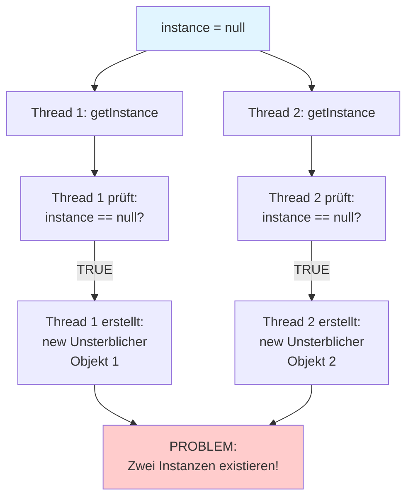
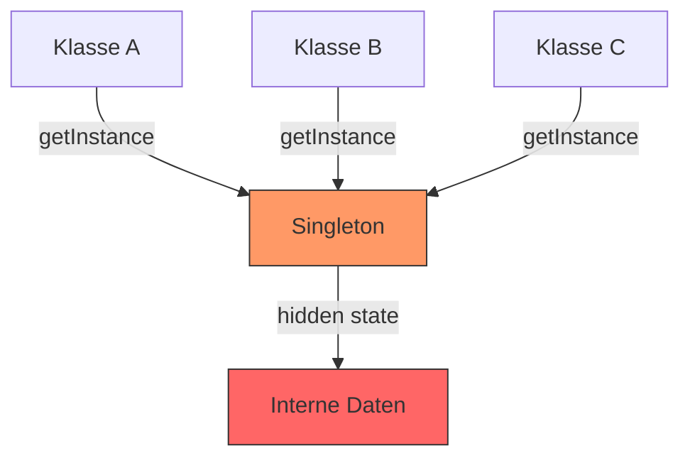
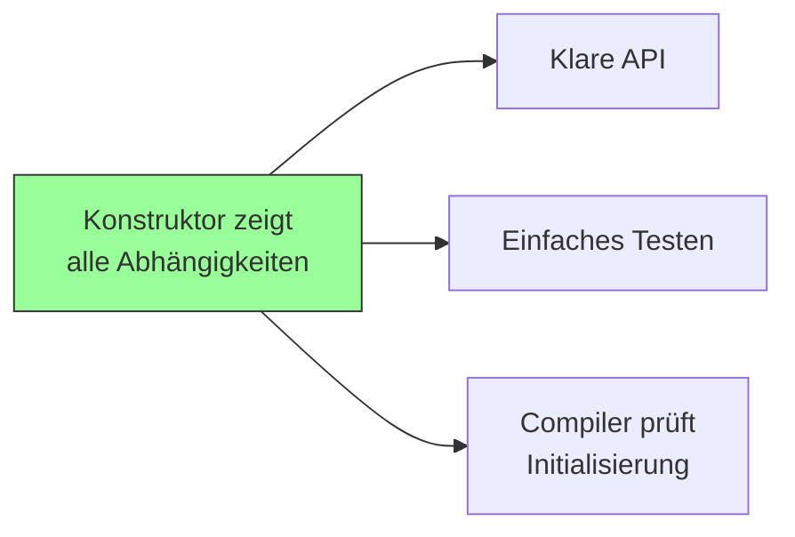

## Design Patterns
**Design Patterns** (Entwurfsmuster) sind bewährte, wiederverwendbare Lösungen für häufig auftretende Probleme in der Softwareentwicklung. Sie sind **keine fertigen Code-Bausteine**, sondern **Vorlagen oder Blaupausen**, die beschreiben, wie man bestimmte Designprobleme lösen kann.

## Die drei Kategorien von Design Patterns

| Creational Patterns<br>(Erzeugungsmuster) | Structural Patterns<br>(Strukturmuster) | Behavioral Patterns<br>(Verhaltensmuster) |
| ----------------------------------------- | --------------------------------------- | ----------------------------------------- |
| ==Singleton==                             | Adapter                                 | Chain of Responsibility                   |
| ==Factory Method==                        | Bridge                                  | Command                                   |
| Abstract Factory                          | ==Composite==                           | Interpreter                               |
| Builder                                   | Decorator                               | Iterator                                  |
| Prototype                                 | Facade                                  | Mediator                                  |
|                                           | Flyweight                               | Memento                                   |
|                                           | Proxy                                   | ==Observer==                              |
|                                           | ==MVC==                                 | State                                     |
|                                           |                                         | ==Strategy==                              |
|                                           |                                         | Template Method                           |
|                                           |                                         | Visitor                                   |

 **Creational (Erzeugungsmuster):** 
 Kontrollieren, WIE Objekte erstellt werden (Konstruktoren, Factories, etc.)

**Structural (Strukturmuster):** 
Definieren, wie Objekte zu größeren Strukturen zusammengesetzt werden (Vererbung, Komposition)

**Behavioral (Verhaltensmuster):** 
Beschreiben, wie Objekte miteinander kommunizieren und Verantwortlichkeiten verteilen (Methodenaufrufe, Events)
## Singleton 

**Singleton Pattern** ist ein Erzeugungsmuster, das sicherstellt, dass von einer Klasse nur **eine einzige Instanz** existiert und einen globalen Zugriffspunkt darauf bietet.

<div style="page-break-after: always;"></div>

## Lazy Creation 

```java
public final class Unsterblicher {
    private static Unsterblicher instance;
    
    private Unsterblicher() {} 
    
    public static Unsterblicher getInstance() {
        if (instance == null)  
            instance = new Unsterblicher();
        
        return instance;
    }
}
```

#### `public final class Unsterblicher`
Da `final` dann ist keine Vererbung möglich (zusätzliche Absicherung)

#### `private static Unsterblicher instance;`

- `static` = Gehört zur Klasse, nicht zu einem Objekt
- Nur **eine** Instanz für die ganze Klasse
- Startwert: `null`

#### `private Unsterblicher() {}`

- `private` = Niemand kann von außen `new Unsterblicher()` aufrufen
- Das erzwingt, dass nur `getInstance()` eine Instanz erstellen kann

#### `if (instance == null)`

- Prüft, ob noch keine Instanz existiert
- **Lazy** = "Faul" wird erst erstellt, wenn jemand sie braucht

#### `instance = new Unsterblicher();`
Erstellt die Instanz **nur beim ersten Aufruf**

### Verwendung

```java
Unsterblicher u1 = Unsterblicher.getInstance();  // Erstellt Instanz
Unsterblicher u2 = Unsterblicher.getInstance();  // Gibt gleiche zurück

System.out.println(u1 == u2);  // true es ist dieselbe Instanz!
```

<div style="page-break-after: always;"></div>

### Problem: Threads

**Was passiert bei zwei parallelen Threads?**


**Lösung mit synchronized:**

```java
public static synchronized Unsterblicher getInstance() {
    if (instance == null)
        instance = new Unsterblicher();
    return instance;
}
```

**Nachteil:** `synchronized` macht die Methode langsamer. Jeder Aufruf muss warten.

<div style="page-break-after: always;"></div>

## Eager Creation 

```java
public final class Unsterblicher {
    private static final Unsterblicher INSTANCE = new Unsterblicher();  
    
    private Unsterblicher() {}
    
    public static Unsterblicher getInstance() {
        return INSTANCE;
    }
}
```

#### `private static final Unsterblicher INSTANCE = new Unsterblicher();`

- Die Instanz wird sofort beim Laden der Klasse erstellt
- Nicht erst beim ersten `getInstance()`-Aufruf
- `final` = Kann nicht mehr geändert werden

#### `return INSTANCE;`

- Gibt nur die bereits existierende Instanz zurück
- Keine if-Prüfung nötig
- Keine `new`-Anweisung

**Warum kein Thread-Problem?**

- Die Instanz wird vom ClassLoader erstellt, **bevor** Threads starten können
- Es gibt keine if-Prüfung, die zu einer Race Condition führen könnte
- `return INSTANCE` ist eine atomare Operation

### Vorteil
Eager Creation ist Thread Sicher, da nur eine Instanz erstellt wird, schon vor dem Existenz von den Threads.

### Nachteil

- Instanz wird erstellt, **auch wenn sie nie gebraucht wird**
- Bei großen Objekten: Verschwendung von Speicher
- Keine verzögerte Initialisierung möglich

<div style="page-break-after: always;"></div>

## Wann welche Variante?

### Lazy Creation verwenden wenn:

- Das Objekt ist groß/teuer zu erstellen
- Das Objekt wird möglicherweise nie gebraucht
- Du bist dir der Thread-Probleme bewusst

**Beispiel:** Datenbankverbindung, die nur manchmal gebraucht wird

### Eager Creation verwenden wenn:

- Das Objekt wird sicher gebraucht
- Das Objekt ist klein/schnell zu erstellen
- Du willst keine Thread-Probleme

**Beispiel:** Logger, der immer gebraucht wird

<div style="page-break-after: always;"></div>

## Probleme des Singleton Patterns

### Globaler Zustand (Global State)



**Problem**: Jeder Teil der Anwendung kann auf denselben Zustand zugreifen, was zu:

- Unvorhersehbarem Verhalten führt
- Reihenfolgeabhängigkeiten erzeugt
- Parallele Tests unmöglich macht

### Erschwert das Testen

Zustand zwischen Tests**: 
Tests können sich gegenseitig beeinflussen

```java
@Test
void testA() {
    Singleton.getInstance().setValue(5);
    // Test endet, Wert bleibt
}

@Test
void testB() {
    // Erwartet frischen Zustand, bekommt aber Wert 5
    assertEquals(0, Singleton.getInstance().getValue());
}
```

**Keine Testverdoppelung möglich**

```java
// Unmöglich zu testen
class PaymentService {
    void processPayment() {
        CreditCardProcessor.getInstance().charge(100);
    }
}

// Kann nicht durch Mock ersetzt werden
```

**Reihenfolge der Tests wichtig**
- Tests sollten unabhängig sein
- Mit Singletons muss man Initialisierungsreihenfolge kennen
- Tests können nicht parallel laufen

### Verschleierte Abhängigkeiten (Deceptive API)

```java
// Schlechtes Beispiel - versteckte Abhängigkeiten
class Order {
    void calculateTotal() {
        Database.getInstance().save(this);
        Logger.getInstance().log("Saved");
        EmailService.getInstance().sendConfirmation();
    }
}
```

**Problem**: API lügt über ihre Abhängigkeiten

- Konstruktor zeigt keine Abhängigkeiten
- Tester muss durch Trial-and-Error herausfinden, was initialisiert werden muss
- Verstößt gegen Principle of Least Surprise

<div style="page-break-after: always;"></div>

### Statische Verklebung (Static Cling)

```java
class AppSettings {
    private static AppSettings instance = new AppSettings();
    private Database db;        // Diese Abhängigkeiten
    private Logger logger;      // werden auch global
    private Cache cache;        // zugänglich
}
```

**Transitivität von Globalität**: Wenn A global ist und B von A abhängt, wird B auch faktisch global.

### Verhindert Erweiterung durch Vererbung

```java
class Singleton {
    private static Singleton instance = new Singleton();
    private Singleton() { }  // Privater Konstruktor!
}

// Unmöglich
class ExtendedSingleton extends Singleton {
    // Kann nicht auf privaten Konstruktor zugreifen
}
```

### Initialisierungsreihenfolge unklar

```java
// Welche Reihenfolge ist korrekt?
Database.connect();
OfflineQueue.start();
CreditCardProcessor.init();

// Oder:
CreditCardProcessor.init();  // NullPointerException!
OfflineQueue.start();
Database.connect();
```

**Problem**: Keine Compile-Zeit-Garantien für korrekte Initialisierung.

<div style="page-break-after: always;"></div>

### Verführt zu prozeduralem Code

```java
// Prozeduraler Stil in OOP-Verkleidung
void processOrder(Order order) {
    OrderValidator.getInstance().validate(order);
    PriceCalculator.getInstance().calculate(order);
    Database.getInstance().save(order);
    EmailSender.getInstance().send(order);
}
```

Ähnelt prozeduralen Funktionsaufrufen statt objektorientierter Nachrichtenübergabe.

>[!tip]
>## Warum Singleton ein Anti-Pattern ist?
> - Singleton ersetzt globale Variablen
> - Verführt zu prozeduralem Programmieren
> - Keine richtige Datenkapselung
> - Versteckte Abhängigkeiten
> - Dependency Injection nicht möglich
> - Man sieht nicht, dass eine Klasse vom Singleton abhängt
> - Testen wird kompliziert
> - Mocking nicht möglich
> - Keine Test-Doubles einsetzbar
> - Keine Vererbung möglich (private Konstruktor)
> - Thread-Overhead bei Lazy Creation (`synchronized` macht es langsam)
> - Ressourcenverschwendung bei Eager Creation (immer im Speicher)
> - Nicht wirklich ein Singleton in Java (eine Instanz pro ClassLoader)
> - In komplexen Systemen können trotzdem mehrere Instanzen entstehen
> - Führt zu unübersichtlichem Code
> - Erschwert Einarbeitung neuer Mitarbeiter

<div style="page-break-after: always;"></div>

## Bessere Alternative: Dependency Injection

### Schlechtes Beispiel (Singleton)

```java
class CreditCard {
    void charge(int amount) {
        CreditCardProcessor.getInstance().process(this, amount);
    }
}

// Test unmöglich zu isolieren
```

### Gutes Beispiel (Dependency Injection)

```java
class CreditCard {
    private CreditCardProcessor processor;
    
    CreditCard(String number, CreditCardProcessor processor) {
        this.number = number;
        this.processor = processor;  // Injiziert
    }
    
    void charge(int amount) {
        processor.process(this, amount);
    }
}

// Test einfach
@Test
void testCharge() {
    MockProcessor mockProcessor = new MockProcessor();
    CreditCard card = new CreditCard("1234", mockProcessor);
    card.charge(100);
    assertTrue(mockProcessor.wasCalledWith(100));
}
```

<div style="page-break-after: always;"></div>

### Vorteile von Dependency Injection



**Konkrete Vorteile**:

1. **Sichtbare Abhängigkeiten**: Konstruktorsignatur zeigt alle benötigten Objekte
2. **Compile-Zeit-Prüfung**: Compiler erzwingt korrekte Reihenfolge
3. **Testbarkeit**: Leichte Substitution durch Test-Doubles
4. **Flexibilität**: Verschiedene Konfigurationen möglich

<div style="page-break-after: always;"></div>

## Objekttypen und Singleton-Verwendung

### Value Objects (Datenobjekte)

```java
class Customer {
    private String name;
    private String email;
    
    // Normale Instanziierung OK
    Customer(String name, String email) {
        this.name = name;
        this.email = email;
    }
}
```

**Eigenschaften**:
- Repräsentieren Daten
- Werden persistiert
- Wenige Abhängigkeiten
- Kommen für Singleton nicht in Betracht
- Setter in Ordnung

### Service Objects (Dienstobjekte)

```java
class EmailService {
    private SmtpConnection connection;
    private Logger logger;
    
    // Dependency Injection bevorzugt
    EmailService(SmtpConnection connection, Logger logger) {
        this.connection = connection;
        this.logger = logger;
    }
}
```

**Eigenschaften**:
- Übernehmen Arbeit
- Keine Persistenz
- Oft als Singleton implementiert (falsch)
- Hier ist DI und Law of Demeter besonders wichtig

<div style="page-break-after: always;"></div>

## Refactoring-Hinweise und Umgang mit Problemen

### Problem: Schnittstelle fordert Standard-Konstruktor

**Lösung:** Adapter-Pattern anwenden

- Wrapper-Klasse erstellen
- Gut testbares Objekt in "hässliches Entlein" (ugly duckling) verkleiden

### Zu viele Konstruktorparameter

```java
class ComplexService {
    ComplexService(
        Database db,
        Logger logger,
        Cache cache,
        Validator validator,
        EmailService email,
        PaymentProcessor payment,
        AuditLog audit
    ) { }
}
```

**Bedeutung:** Das ist ein Design-Problem. Man sollte ein Refactoring durchführen, um das Problem zu beheben

### Lösungsansätze

**1. Klasse aufteilen**: Single Responsibility Principle anwenden
**2. Facade Pattern**: Mehrere zusammenhängende Objekte kapseln
**3. Builder Pattern**: Komplexe Objektkonstruktion vereinfachen
**4. Parameter Object**: Zusammengehörige Parameter gruppieren

<div style="page-break-after: always;"></div>

## Wann ist "ein Objekt" in Ordnung?

### Architektonische Entscheidung statt Erzwingung

```java
// Main-Methode erstellt ein Objekt
class Application {
    public static void main(String[] args) {
        Database db = new Database();
        EmailService email = new EmailService(db);
        OrderService orders = new OrderService(db, email);
        
        Application app = new Application(orders);
        app.run();
    }
}
```

| Aspekt         | Nur ein Objekt (singleton) verwenden | Singleton Pattern                       |
| -------------- | ------------------------------------ | --------------------------------------- |
| Instanziierung | Normal über Konstruktor              | Erzwungen über getInstance()            |
| Zugriff        | Referenz wird übergeben              | Globaler Zugriff über statische Methode |
| Kontrolle      | Durch Architektur                    | Durch Klassenmechanismus                |
| Testbarkeit    | Gut testbar (DI)                     | Schwer testbar                          |
| Flexibilität   | Mehrere Instanzen möglich bei Bedarf | Technisch auf eine Instanz beschränkt   |

---
>[!warning]
>Don't be **S**TUPID!
>- **S**ingleton
>- **T**ight Coupling
>- **U**ntestability
>- **P**remature Optimization
>- **I**ndescriptive Naming
>- **D**uplication