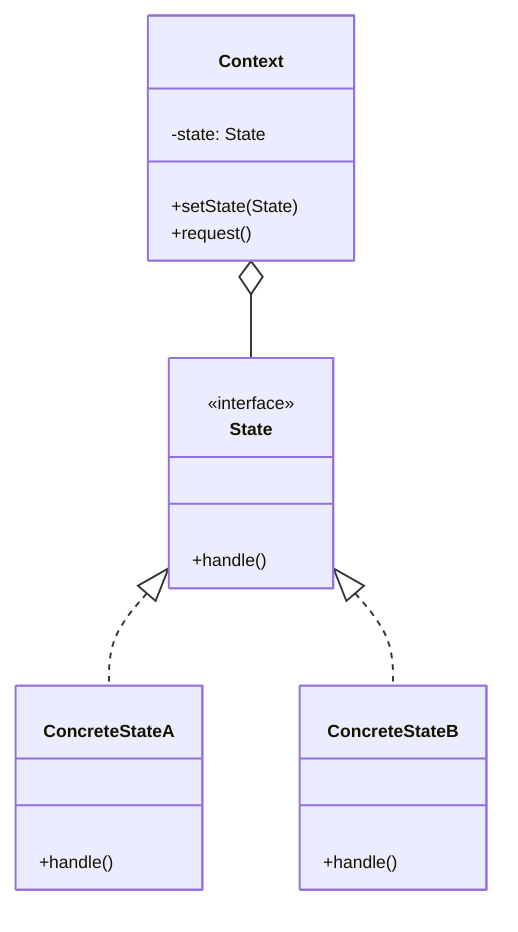

## Zustandsdiagramme (State Machine Diagrams)

Zustandsdiagramme visualisieren die verschiedenen Zustände eines Objekts und die Übergänge zwischen diesen Zuständen.

![[Archive/Attachments/Pasted image 20251216220856.png|400]]
#### Symbole
![[Archive/Attachments/Pasted image 20251216220959.png|400]]

- **entry**: Wird ausgeführt beim Betreten des Zustands
- **do**: Wird während des Zustands ausgeführt
- **exit**: Wird ausgeführt beim Verlassen des Zustands
- **ereignis**: Interne Transition ohne Zustandswechsel

### Pseudozustände
Pseudozustände fassen mehrere Transitionen in einer komplexen Transition zusammen.

![[Archive/Attachments/Pasted image 20251216221657.png|400]]

## Tür
![[Archive/Attachments/Pasted image 20251216221823.png|400]]

## Was ist das Zustandsmuster (State Pattern)?

Das **State Pattern** ist ein Verhaltensmuster, das es einem Objekt ermöglicht, sein Verhalten zu ändern, wenn sich sein interner Zustand ändert. Es sieht so aus, als würde das Objekt seine Klasse wechseln.

### Kernidee

Anstatt mit vielen if-else oder switch-case Anweisungen zu arbeiten, werden verschiedene Zustände in separate Zustandsklassen ausgelagert. Jeder Zustand implementiert sein eigenes Verhalten.

>[!info]
>State Pattern wird zb. in Zeichentools angewendet
## Vorteile des State Patterns

- Keine komplexen Conditionals: Eliminiert große if-else oder switch-case Blöcke
- Klare Struktur: Jeder Zustand ist eine eigene Klasse
- Leicht erweiterbar: Neue Zustände hinzufügen ohne bestehenden Code zu ändern
- Open/Closed Principle: Offen für Erweiterung, geschlossen für Änderung
- Single Responsibility: Jede Zustandsklasse hat eine klare Verantwortung
- Zustandsübergänge explizit: Transitions sind klar definiert

## Nachteile des State Patterns

- Rechtfertigt bei einfachem Verhalten nicht den hohen Implementierungsaufwand
- Ohne UML-Zustandsdiagramm sehr schwer zu durchblicken
## Allgemeine Struktur


## Tür Implementation

### Variante 1
Klassisches State Pattern mit dauerhaften Zustandsobjekten. Der Context besitzt alle Zustände dauerhaft als Attribute. Jeder konkrete State hält eine Referenz auf den Context. Zustandswechsel erfolgen im State selbst.

**Vorteile**
- Sehr nah an UML-State-Diagrammen
- Klar nachvollziehbare Zustandsübergänge
- Gut geeignet, wenn Zustände **interne Daten** speichern sollen

**Nachteile**

- Starke Kopplung: State kennt Context
- Mehr Boilerplate
- Schwerer wiederzuverwenden

**StateGeoeffnet.java**

```java
package tuer;

public class StateGeoeffnet implements TuerState {
	Tuer Haupt;
	
	
	public void tuereAbschliessen() {
		System.out.println("Die Türe ist geöffnet und kann nicht abgeschlossen werden.");
		
	}

	
	public void tuereAufschliessen() {
		System.out.println("Die Türe ist geöffnet und kann nicht aufgeschlossen werden.");
		
	}

	
	public void tuereOeffnen() {
		System.out.println("Die Türe ist schon offen.");
		
	}

	
	public void tuereSchliessen() {
		System.out.println("Die Türe ist nun geschlossen.");
		Haupt.setZustand(Haupt.getStateGeschlossen());
		
	}
	
	public StateGeoeffnet(Tuer haupt)
	{
		this.Haupt = haupt;
	}	

}
```

**StateGeschlossen.java**

```java
package tuer;

public class StateGeschlossen implements TuerState {
	Tuer Haupt;

	
	public void tuereAbschliessen() {
		System.out.println("Die Türe ist nun verschlossen.");
		Haupt.setZustand(Haupt.getStateAbgeschlossen());
		
		
	}

	
	public void tuereAufschliessen() {
		System.out.println("Die Türe ist nicht abgeschlossen.");
		
	}

	
	public void tuereOeffnen() {
		System.out.println("Die Türe ist nun geöffnet.");
		Haupt.setZustand(Haupt.getStateGeoeffnet());
		
	}

	
	public void tuereSchliessen() {
		System.out.println("Die Türe ist nicht geöffnet.");
		
	}
	
	public StateGeschlossen(Tuer haupt)
	{
		this.Haupt = haupt;
	}	

}
```

**StateAbgeschlossen.java**

```java
package tuer;

public class StateAbgeschlossen implements TuerState {

	Tuer Haupt;
	
	public void tuereAbschliessen() {
		System.out.println("Die Türe ist schon abgeschlossen.");
		
	}

	
	public void tuereAufschliessen() {
		System.out.println("Die Türe ist nun aufgeschlossen.");
		Haupt.setZustand(Haupt.getStateGeschlossen());
		
	}

	
	public void tuereOeffnen() {
		System.out.println("Die Türe ist verschlossen.");
		
	}

	
	public void tuereSchliessen() {
		System.out.println("Die Türe ist schon geschlossen.");
		
	}
	
	public StateAbgeschlossen(Tuer haupt)
	{
		this.Haupt = haupt;
	}

}
```

**TuerState.java**

```java
package tuer;

public interface TuerState {
	void tuereOeffnen();
	void tuereSchliessen();
	void tuereAbschliessen();
	void tuereAufschliessen();
}
```

**Tuer.java**

```java
package tuer;

public class Tuer{

	TuerState geoeffnet;
	TuerState geschlossen;
	TuerState abgeschlossen;

	TuerState zustand;

	public Tuer()
	{
		geoeffnet = new StateGeoeffnet(this);
		geschlossen = new StateGeschlossen(this);
		abgeschlossen = new StateAbgeschlossen(this);

		zustand = geschlossen;
	}

	public void setZustand(TuerState zustand)
	{
		this.zustand = zustand;
	}

	public void tuereOeffnen() {
		zustand.tuereOeffnen();
	}

	public void tuereSchliessen() {
		zustand.tuereSchliessen();
	}

	public void tuereAbschliessen() {
		zustand.tuereAbschliessen();
	}

	public void tuereAufschliessen() {
		zustand.tuereAufschliessen();
	}
}
```

**Main.java**

```java
package tuer;

public class Main {

	public static void main(String[] args) {
		Tuer start = new Tuer();
		start.tuereAufschliessen();
		start.tuereAbschliessen();
		start.tuereOeffnen();
		start.tuereAufschliessen();
		start.tuereOeffnen();
		start.tuereAbschliessen();
		start.tuereSchliessen();
		start.tuereSchliessen();
		start.tuereAbschliessen();
	}

}

```

### Variante 2

State Pattern ohne dauerhafte Zustandsobjekte (zustandsrückgebend / funktional). Zustände sind kurzlebige Objekte. Jede Zustandsmethode gibt den nächsten Zustand zurück. Der Context ersetzt lediglich seine Zustandsreferenz.

**Vorteile**

- Geringe Kopplung: State kennt den Context nicht
- Sehr gut testbar durch reine Zustandslogik
- Einfaches, übersichtliches Kontrollflussmodell
- Kein zyklischer Bezug zwischen Context und State

**Nachteile**

- Viele Objektinstanzen bei häufigen Zustandswechseln
- Zustände können keine Context-Daten verwenden
- Weniger geeignet für komplexe Zustandslogik mit Speicherbedarf

**StateGeoeffnet.java**

```java
package tuerOhneDauerZustaende;

public class StateGeoeffnet implements TuerState {

	public TuerState tuereAbschliessen() {
		
		System.out.println("Die Türe ist geöffnet und kann nicht abgeschlossen werden.");
		return this;
	}

	public TuerState tuereAufschliessen() {
		
		System.out.println("Die Türe ist geöffnet und kann nicht aufgeschlossen werden.");
		return this;
	}

	public TuerState tuereOeffnen() {
		
		System.out.println("Die Türe ist schon offen.");
		return this;
	}
	public TuerState tuereSchliessen() {
		
		System.out.println("Die Türe ist nun geschlossen.");
		return new StateGeschlossen();
		
	}
}

```

**StateGeschlossen.java**

```java
package tuerOhneDauerZustaende;

public class StateGeschlossen implements TuerState {

	public TuerState tuereAbschliessen() {
		
		System.out.println("Die Türe ist nun verschlossen.");
		return new StateAbgeschlossen();
	}
	public TuerState tuereAufschliessen() {
		
		System.out.println("Die Türe ist nicht abgeschlossen.");
		return this;
	}
	public TuerState tuereOeffnen() {
		
		System.out.println("Die Türe ist nun geöffnet.");
		return new StateGeoeffnet();
	}
	public TuerState tuereSchliessen() {
		
		System.out.println("Die Türe ist nicht geöffnet.");
		return this;
	}
}

```

**StateAbgeschlossen.java**

```java
package tuerOhneDauerZustaende;

public class StateAbgeschlossen implements TuerState {

	public TuerState tuereAbschliessen() {
		
		System.out.println("Die Türe ist schon abgeschlossen.");
		return this;
	}
	public TuerState tuereAufschliessen() {
		
		System.out.println("Die Türe ist nun aufgeschlossen.");
		return new StateGeschlossen();
	}
	public TuerState tuereOeffnen() {
		
		System.out.println("Die Türe ist verschlossen.");
		return this;
	}
	public TuerState tuereSchliessen() {
		
		System.out.println("Die Türe ist schon geschlossen.");
		return this;
	}
}
```

**TuerState.java**

```java
package tuerOhneDauerZustaende;

public interface TuerState {
	TuerState tuereOeffnen();
	TuerState tuereSchliessen();
	TuerState tuereAbschliessen();
	TuerState tuereAufschliessen();
}
```

**Tuer.java**

```java
package tuerOhneDauerZustaende;

public class Tuer{

	TuerState zustand;

	public Tuer() {
		this.zustand = new StateGeschlossen();
	}
	public void setZustand(TuerState zustand) {
		this.zustand = zustand;
	}

	public void tuereAbschliessen() {
		zustand = zustand.tuereAbschliessen();
		
	}
	public void tuereAufschliessen() {
		zustand = zustand.tuereAufschliessen();
		
	}
	public void tuereOeffnen() {
		zustand = zustand.tuereOeffnen();
	}
	public void tuereSchliessen() {
		zustand = zustand.tuereSchliessen();
	}
}

```

**Main.java**

```java
package tuerOhneDauerZustaende;

public class Main {

	public static void main(String[] args) {
		Tuer start = new Tuer();
		start.tuereAufschliessen();
		start.tuereAbschliessen();
		start.tuereOeffnen();
		start.tuereAufschliessen();
		start.tuereOeffnen();
		start.tuereAbschliessen();
		start.tuereSchliessen();
		start.tuereSchliessen();
		start.tuereAbschliessen();
	}
}
```

### Variante 3

Statische Zustände (Singleton-artige Lösung). Alle Zustände existieren genau einmal als statische Instanzen. Der Context wird den Zuständen bei jedem Methodenaufruf übergeben.

**Vorteile**

- Sehr geringer Speicherverbrauch
- Keine Erzeugung neuer State-Objekte
- Zustände klar voneinander getrennt und wiederverwendbar
- Gut geeignet für viele gleichartige Context-Objekte

**Nachteile**

- Zustände dürfen keinen eigenen internen Zustand besitzen
- Höhere Abhängigkeit durch globale State-Instanzen
- Weniger flexibel bei späteren Erweiterungen

**StateGeoeffnet.java**

```java
package tuerStaticLsg;

public class StateGeoeffnet implements TuerState {

	@Override
	public void tuereAbschliessen(Tuer t) {
		System.out.println("Die Türe ist geöffnet und kann nicht abgeschlossen werden.");
	}

	@Override
	public void tuereAufschliessen(Tuer t) {
		System.out.println("Die Türe ist geöffnet und kann nicht aufgeschlossen werden.");
		
	}
	@Override
	public void tuereOeffnen(Tuer t) {
		System.out.println("Die Türe ist schon offen.");

	}
	@Override
	public void tuereSchliessen(Tuer t) {
		System.out.println("Die Türe ist nun geschlossen.");
		t.setZustand(Tuer.getStateGeschlossen());
		
	}
}
```

**StateGeschlossen.java**

```java
package tuerStaticLsg;

public class StateGeschlossen implements TuerState {
	
	@Override
	public void tuereAbschliessen(Tuer t) {
		
		System.out.println("Die Türe ist nun verschlossen.");
		t.setZustand(Tuer.getStateAbgeschlossen());
	}
	@Override
	public void tuereAufschliessen(Tuer t) {
		
		System.out.println("Die Türe ist nicht abgeschlossen.");
	}
	@Override
	public void tuereOeffnen(Tuer t) {
		
		System.out.println("Die Türe ist nun geöffnet.");
		t.setZustand(Tuer.getStateGeoeffnet());
	}
	@Override
	public void tuereSchliessen(Tuer t) {
		
		System.out.println("Die Türe ist nicht geöffnet.");
	}
}
```

**StateAbgeschlossen.java**

```java
package tuerStaticLsg;

public class StateAbgeschlossen implements TuerState {
	
	@Override
	public void tuereAbschliessen(Tuer t) {
		System.out.println("Die Türe ist schon abgeschlossen.");
		
	}
	@Override
	public void tuereAufschliessen(Tuer t) {
		System.out.println("Die Türe ist nun aufgeschlossen.");
		t.setZustand(Tuer.getStateGeschlossen());
	}
	@Override
	public void tuereOeffnen(Tuer t) {
		System.out.println("Die Türe ist verschlossen.");
	}
	@Override
	public void tuereSchliessen(Tuer t) {
		System.out.println("Die Türe ist schon geschlossen.");
	}
}
```

**TuerState.java**

```java
package tuerStaticLsg;

public interface TuerState {
	void tuereOeffnen(Tuer t);
	void tuereSchliessen(Tuer t);
	void tuereAbschliessen(Tuer t);
	void tuereAufschliessen(Tuer t);
}
```

**Tuer.java**

```java
package tuerStaticLsg;

public class Tuer{

	private static TuerState stateAbgeschlossen=new StateAbgeschlossen();
	private static TuerState stateGeschlossen = new StateGeschlossen();
	private static TuerState stateGeoeffnet = new StateGeoeffnet();;
	
	TuerState zustand;

	public Tuer() {
		this.zustand = getStateGeschlossen();
	}
	public static TuerState getStateAbgeschlossen() {
		return stateAbgeschlossen;
	}

	public static TuerState getStateGeschlossen() {
		return stateGeschlossen;
	}
	public static TuerState getStateGeoeffnet() {
		return stateGeoeffnet;
	}
	public void setZustand(TuerState zustand) {
		
		this.zustand = zustand;
	}
	public void TuereAbschliessen() {
		
		zustand.tuereAbschliessen(this);
	}
	public void TuereAufschliessen() {
		
		zustand.tuereAufschliessen(this);
	}
	public void TuereOeffnen() {
		
		zustand.tuereOeffnen(this);
	}
	public void TuereSchliessen() {
		
		zustand.tuereSchliessen(this);
	}
}
```

**Main.java**

```java
package tuerStaticLsg;

public class Main {

	public static void main(String[] args) {
		Tuer start = new Tuer();
		start.TuereAufschliessen();
		start.TuereAbschliessen();
		start.TuereOeffnen();
		start.TuereAufschliessen();
		start.TuereOeffnen();
		start.TuereAbschliessen();
		start.TuereSchliessen();
		start.TuereSchliessen();
		start.TuereAbschliessen();
	}

}

```
