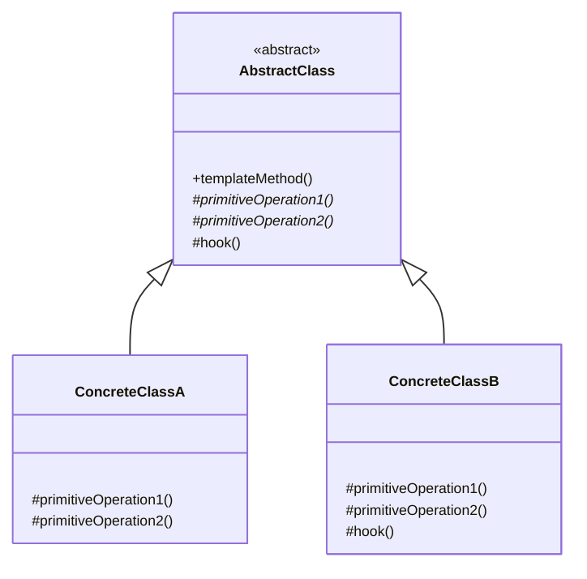
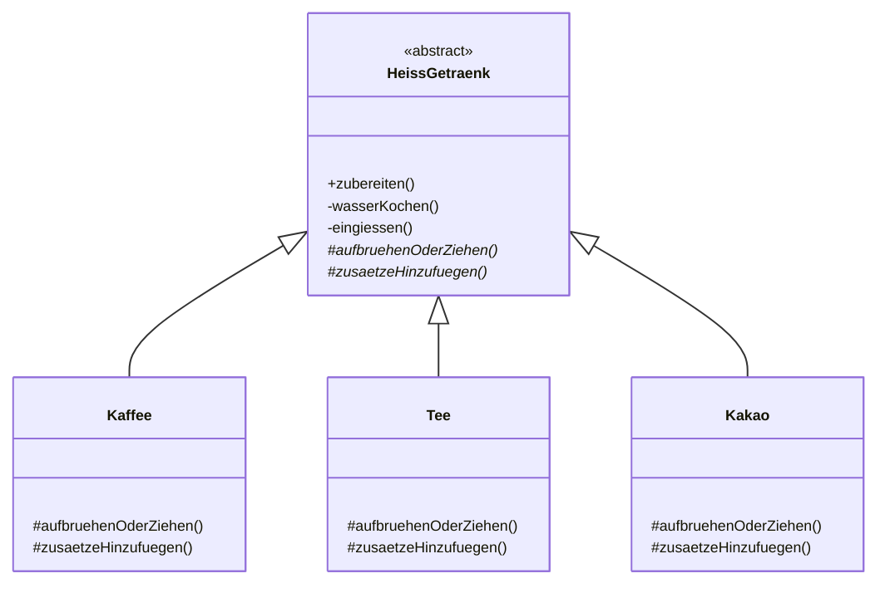

## Was ist das Template Method Pattern?

Das **Template Method Pattern** ist ein Verhaltensmuster, das das Skelett eines Algorithmus in einer Methode definiert, aber bestimmte Schritte an Subklassen delegiert.

### Kernidee

Eine abstrakte Basisklasse definiert die Struktur eines Algorithmus (die "Template Method"), während konkrete Subklassen einzelne Schritte implementieren. Die Reihenfolge der Schritte ist festgelegt und kann nicht geändert werden.

## Struktur des Template Method Patterns



### Komponenten

1. **AbstractClass**: Definiert die Template Method mit dem Algorithmus-Skelett
2. **primitiveOperations**: Abstrakte Methoden, die von Subklassen implementiert werden müssen
3. **hook**: Optionale Methoden mit Default-Implementierung, die überschrieben werden können
4. **ConcreteClass**: Implementiert die primitiven Operationen


## Vorteile des Template Method Patterns

- Verhindert Code-Duplikation: Gemeinsame Logik wird nur einmal definiert
- Garantiert Ablaufreihenfolge: Die Schritte werden in der richtigen Reihenfolge ausgeführt
- Klare Struktur: Der Algorithmus ist zentral definiert und übersichtlich
- Open/Closed Principle: Neue Varianten ohne Änderung der Template Method
- Hollywood-Prinzip: "Don't call us, we'll call you" - Die Basisklasse steuert den Ablauf
## Design Principles

### Hollywood-Prinzip

> "Don't call us, we'll call you"

High-Level Komponenten sollten nicht von low-level Komponenten abhängen, sondern umgekehrt. Die Basisklasse kontrolliert den Algorithmus-Ablauf und ruft die Methoden der Subklassen auf - nicht umgekehrt.
### Open/Closed Principle

> Offen für Erweiterung, geschlossen für Änderung

**Mit Template Method Pattern:**

- Neue Variante → Neue Subklasse erstellen
- Template Method bleibt unverändert
- Algorithmus-Struktur geschützt

**Ohne Template Method Pattern:**

- Neue Variante → Bestehenden Code ändern
- Risiko: Algorithmus-Reihenfolge durcheinander
- if-else Ketten wachsen

## Hooks (Optionale Methoden)

**Hooks** sind optionale Methoden mit einer Default-Implementierung (oft leer), die Subklassen überschreiben können.

```java
abstract class AbstrakterProzess {

    // Template Method
    public final void ausfuehren() {
        grundSchritt();
        if (hook()) {
            optionalerSchritt();
        }
        endSchritt();
    }

    private void grundSchritt() {
        System.out.println("Grundschritt");
    }

    private void endSchritt() {
        System.out.println("Endschritt");
    }

    // Hook (optional)
    protected boolean hook() {
        return false;
    }

    protected void optionalerSchritt() {
        System.out.println("Optionaler Schritt");
    }
}

class KonkreterProzess extends AbstrakterProzess {

    @Override
    protected boolean hook() {
        return true;
    }
}

```


## Beispiel: Heißgetränke-Zubereitung



### Abstrakte Basisklasse

#### HeissGetraenk.java

```java
public abstract class HeissGetraenk {
    
    // Template Method, final verhindert Überschreiben
    public final void zubereiten() {
        wasserKochen();
        aufbruehenOderZiehen();
        eingiessen();
        zusaetzeHinzufuegen();
    }
    
    // Feste Schritte, daher private
    private void wasserKochen() {
        System.out.println("Wasser wird gekocht");
    }
    
    private void eingiessen() {
        System.out.println("In Tasse eingießen");
    }
    
    // Variable Schritte, müssen implementiert werden
    protected abstract void aufbruehenOderZiehen();
    protected abstract void zusaetzeHinzufuegen();
}
```


### Konkrete Klassen

#### Kaffee.java

```java
public class Kaffee extends HeissGetraenk {
    
    @Override
    protected void aufbruehenOderZiehen() {
        System.out.println("Kaffee wird aufgebrüht");
    }
    
    @Override
    protected void zusaetzeHinzufuegen() {
        System.out.println("Zucker und Milch hinzufügen");
    }
}
```

#### Tee.java

```java
public class Tee extends HeissGetraenk {
    
    @Override
    protected void aufbruehenOderZiehen() {
        System.out.println("Tee ziehen lassen");
    }
    
    @Override
    protected void zusaetzeHinzufuegen() {
        System.out.println("Zitrone hinzufügen");
    }
}
```

#### Kakao.java

```java
public class Kakao extends HeissGetraenk {
    
    @Override
    protected void aufbruehenOderZiehen() {
        System.out.println("Kakao-Pulver einrühren");
    }
    
    @Override
    protected void zusaetzeHinzufuegen() {
        System.out.println("Sahne hinzufügen");
    }
}
```


### Main

```java
public class MainGetraenke {
    
    public static void main(String[] args) {
        
        System.out.println("Kaffee zubereiten:");
        HeissGetraenk kaffee = new Kaffee();
        kaffee.zubereiten();
        
        System.out.println("\nTee zubereiten:");
        HeissGetraenk tee = new Tee();
        tee.zubereiten();
        
        System.out.println("\nKakao zubereiten:");
        HeissGetraenk kakao = new Kakao();
        kakao.zubereiten();
    }
}
```

**Ausgabe:**

```
Kaffee zubereiten:
Wasser wird gekocht
Kaffee wird aufgebrüht
In Tasse eingießen
Zucker und Milch hinzufügen

Tee zubereiten:
Wasser wird gekocht
Tee ziehen lassen
In Tasse eingießen
Zitrone hinzufügen

Kakao zubereiten:
Wasser wird gekocht
Kakao-Pulver einrühren
In Tasse eingießen
Sahne hinzufügen
```

## Wann Template Method Pattern verwenden?

#### Verwenden wenn:

- Mehrere Klassen ähnliche Algorithmen mit unterschiedlichen Details haben
- Code-Duplikation in ähnlichen Algorithmen vermieden werden soll
- Die Reihenfolge der Schritte wichtig und fest ist
- Nur einzelne Schritte variabel sein sollen
- Subklassen nur spezifische Teile eines Algorithmus ändern sollen

#### Nicht verwenden wenn:

- Der gesamte Algorithmus ausgetauscht werden soll (→ Strategy Pattern)
- Die Reihenfolge der Schritte variabel sein soll
- Das Verhalten zur Laufzeit geändert werden soll (→ Strategy Pattern)
- Keine gemeinsame Algorithmus-Struktur existiert

## Wichtige Hinweise

Template Method sollte final sein. Subklassen könnten sonst den gesamten Algorithmus ändern, was dem Pattern widerspricht.

### Sichtbarkeit der Methoden

- **public**: Template Method
- **protected**: Primitive Operationen und Hooks (für Subklassen)
- **private**: Feste Schritte (nicht überschreibbar)

### Vererbung vs. Komposition

Template Method Pattern nutzt **Vererbung**, was bedeutet:

**Vorteile:**

- Einfache Struktur
- Klare Hierarchie
- Compiler prüft abstrakte Methoden

**Nachteile:**

- Enge Kopplung durch Vererbung
- Nicht zur Laufzeit änderbar
- Nur eine Implementierung pro Klasse

**Alternative:** Strategy Pattern für mehr Flexibilität