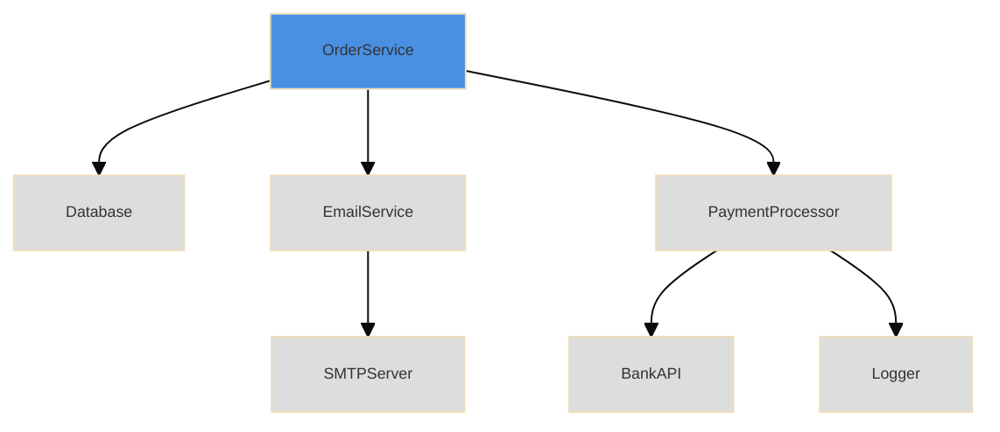
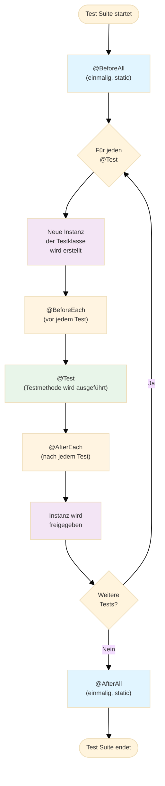

## Test Pyramide
![[Archive/Attachments/Pasted image 20251025200600.png|400]]
> [!Tip]
> Die gesamte System zu testen ist teuer und sagt dir nicht, was kaputt ist. Das Testen einzelner Komponenten ist billiger und sagt dir genau, was zu ersetzen ist.

#### Szenario Tests
System wird aus Sicht des Users getestet. Wenige Tests, langsam, aber sehr schwer zu debuggen, da man nicht genau weiß, wo der Fehler liegt. Nachteil: Flaky, manchmal funktioniert es, manchmal nicht.
 
#### Funktionstests
Interaktionen zwischen Klassen werden getestet. Mittlere Anzahl und Geschwindigkeit. Fehler liegen wahrscheinlich im Aufbau, ohne Unit Tests kann er aber auch in der Logik einzelner Klassen liegen. Vorteil: simulierte Abhängigkeiten.

#### Unit Tests
Eine einzelne Klasse wird getestet. Viele Tests, sehr schnell. Relativ einfach zu debuggen, da der Fehler in der getesteten Klasse liegt. Vorteile: leicht zu schreiben, automatisiertes Testen möglich.  ==Sie sind die Bausteine von "Regressionstests"== und werden automatisch ausgewertet.

> [!important]
> Alle Ebenen sind notwendig. Kleinere Tests decken weniger ab, mehr Tests nötig. Testbarkeit wird wichtiger je fokussierter der Test.

<div style="page-break-after: always;"></div>

## Was macht Code schwer testbar?

### Häufige Irrtümer (nicht die wahren Probleme)

#### Private Methoden

Private Methoden gehören nicht zur öffentlichen Schnittstelle einer Klasse. Man muss sie nicht direkt testen, weil sie automatisch durch das Testen der öffentlichen Methoden mitgetestet werden. Wenn eine öffentliche Methode funktioniert und dabei private Methoden nutzt, sind diese auch getestet.

#### Using `final`

Das `final` Keyword verhindert, dass Werte verändert werden können. Das ist kein Problem beim Testen, weil unveränderliche Objekte sogar einfacher zu testen sind. Es gibt keinen Stimulus (Veränderung) am System, aber das macht das Testen nicht schwieriger.

#### Lange Methoden

Lange Methoden sind nicht unbedingt schwierig zu testen. Man muss nur verschiedene Testfälle für jeden Zweig (if-else, switch) konstruieren. Es sind zwar mehr Tests nötig, aber technisch nicht schwieriger.

### Die wahren Probleme

#### Mixing `new` with business logic

Wenn der `new` Operator direkt im produktiven Code steht, entstehen verdeckte Abhängigkeiten. Das bedeutet: Die Klasse erstellt ihre Abhängigkeiten selbst, und man kann sie im Test nicht austauschen.

```java
class OrderService {
    void processOrder(Order order) {
        Database db = new MySQLDatabase();  // Problem!
        db.save(order);
    }
}
```

Im Test muss man jetzt immer mit einer echten MySQL-Datenbank arbeiten. Man kann keine Test-Datenbank einsetzen.

>[!danger]
>Das Schlüsselwort new gehört in eine Factory Klasse und **nicht** in produktiven Code.

<div style="page-break-after: always;"></div>

#### Mixing Service and Value in one class
Wenn man in einer einzigen Klasse **zwei unterschiedliche Verantwortlichkeiten** mischt:  
eine **Service-Rolle** (also Logik, die etwas _tut_) und eine **Value-Rolle** (also ein Objekt, das nur _Daten hält_).

```java
class Invoice {
    double total;
    double tax;

    void calculateTotal() {
        Database.save(this);  // Service-Aufgabe
        total = total + tax;  // Value-Aufgabe
    }
}

```

#### Looking for things (Verletzung des Law of Demeter)

Wenn Code wie `customer.getWallet().getMoney()` aussieht, spricht man von "looking for things". Das bedeutet: Man muss durch mehrere Objekte navigieren, um das zu bekommen, was man braucht.

**Problem beim Testen:** Man muss alle Zwischenobjekte (Customer, Wallet) erstellen, nur um an Money zu kommen. Das sind verdeckte Abhängigkeiten.

#### Doing "work" in the constructor

Wenn im Konstruktor produktiver Code ausgeführt wird (z.B. Datenbankverbindungen öffnen, Berechnungen durchführen), kann man diesen Code nicht unabhängig von der Objekterstellung testen.

```java
class ReportGenerator {
    ReportGenerator() {
        this.connection = new DatabaseConnection();  // Arbeit im Konstruktor
        this.connection.connect();
        this.data = this.connection.loadData();
    }
}
```

**Problem:** Jedes Mal, wenn man das Objekt erstellt (auch im Test), wird die Datenbankverbindung aufgebaut. Man kann die Objekterstellung nicht vom eigentlichen Verhalten trennen.

<div style="page-break-after: always;"></div>

#### Global state, static variables, static methods

Bei statischen Methoden und globalem Zustand entsteht eine tiefe Methodenaufrufkette. Alle Methoden in dieser Kette werden automatisch mitgetestet, weil es keinen **Seam** (Nahtstelle) gibt, an dem man eine Test-Version einsetzen könnte.

```java
class UserService {
    void updateUser(User user) {
        Database.getInstance().save(user);  // Static!
    }
}
```

**Problem:** Man kann `Database.getInstance()` im Test nicht durch eine Test-Datenbank ersetzen. Es werden immer alle Methoden mitgetestet.

#### Deep inheritance

Bei tiefer Vererbung testet ein Test automatisch alle Elternklassen mit. Das bedeutet: Wenn eine Methode fehlschlägt, weiß man nicht, ob der Fehler in der aktuellen Klasse oder in einer der Elternklassen liegt.

#### Too many conditionals

Wenn eine Methode viele if-else oder switch-case Statements hat, braucht man sehr viele Tests, um alle Zweige abzudecken. Conditionals werden häufig verändert, was bedeutet, dass man die Tests jedes Mal anpassen muss.

```java
void calculatePrice(Order order) {
    if (order.isPremium()) {
        if (order.hasDiscount()) {
            if (order.isWeekend()) {
                // 8 verschiedene Kombinationen!
            }
        }
    }
}
```

Jede Kombination braucht einen eigenen Test.

<div style="page-break-after: always;"></div>

## Law of Demeter

#### Definition
> Don't talk to strangers, only talk to your friends and only ask for what you need. Stell dir vor, du kaufst etwas für 25 Euro im Laden. Gibst du dem Verkäufer deine gesamte Geldbörse und lässt ihn die 25 Euro selbst herausholen oder gibst du dem Verkäufer direkt die 25 Euro?

Das Law of Demeter besagt: Übergebe nur Objekte, die du **direkt benötigst**, nicht Objekte, um andere Objekte zu holen.

>[!Note]
>Die Law of Demeter sagt aus, dass **Methoden** mit ihren **Parametern** nach den **Argumenten** fragen, die sie **direkt** für ihre Aufgabe benötigen. Außerdem unterstützt das Law of Demeter das Testen, indem **Signaturen** durch Parameter nach dem fragen, was direkt zum Erfüllen der Aufgabe benötigt wird,


#### Law of Demeter verletzt

```java
class Goods {
    AccountsReceivable ar;
    
    void purchase(Customer c) {
        Money m = c.getWallet().getMoney();  // VERLETZT Law of Demeter!
        ar.recordSale(this, m);
    }
}
```

**Problem:** Test erfordert komplette Object-Chain (Customer → Wallet → Money):

```java
void testPurchaseIsHorribleBreaksLoD() {
    Money m = new Money(25, USD);
    Wallet w = new Wallet(m);
    Customer c = new Customer(w);
    g.purchase(c);
    assertEquals(25, ar.getSales());
}
```

<div style="page-break-after: always;"></div>

#### Law of Demeter eingehalten

```java
class Goods {
    void purchase(Money m) {
        ar.recordSale(this, m);
    }
}
```

**Vorteil:** Test ist minimal:

```java
void testPurchaseTheRightWay() {
    g.purchase(new Money(25, USD));
    assertEquals(25, ar.getSales());
}
```

#### Erkennungsmerkmale

- `a.getX().getY()...` = Verletzung
- Objekte als Parameter übergeben, nur um etwas daraus zu holen

>[!Success]
>**Dependency Injection** ist die Lösung. Injiziere das spezifische Objekt direkt, statt es durch getter-Ketten zu holen. Es wird auch **Hollywood Principle** genannt: "Don't call us, we'll call you"

<div style="page-break-after: always;"></div>

## Dependency Injection

**Definition:** Übergebe benötigte Objekte als Parameter an Methoden/Konstruktoren statt sie intern zu erstellen.

#### Warum?
Trennung von **Object Construction** und **Business Logic**: testbarer Code.

### Das Problem

Wenn die Klasse Abhängigkeiten hat, die CPU-intensiv, destruktiv oder extern sind: Tests werden langsam, instabil oder gefährlich.

### Die Lösung: Seams

Ein **Seam** ist eine Stelle, wo wir Abhängigkeiten austauschen können. Durch DI injizieren wir im Test "Friendly" Test-Doubles.

### Beispiel

**Untestbar - ohne DI:**

```java
class ReportGenerator {
    public ReportGenerator() {
        this.db = new Database("production-server");  // Hart kodiert!
    }
}
```

**Testbar - mit DI:**

```java
class ReportGenerator {
    public ReportGenerator(Database db) {  // Injiziert!
        this.db = db;
    }
}

@Test
void testReport() {
    Database mockDb = new MockDatabase();
    ReportGenerator gen = new ReportGenerator(mockDb);
    assertEquals(expected, gen.generateReport());
}
```

<div style="page-break-after: always;"></div>

## Test-Doubles

#### Dummy
Leeres Objekt, wird als Argument benötigt aber nicht verwendet.

```java
Logger dummyLogger = new DummyLogger();  // Irrelevant für Test
Calculator calc = new Calculator(dummyLogger);
```

#### Mock Object
Konfigurierbar, zeichnet Methodenaufrufe auf, gibt feste Werte zurück.

```java
MockDatabase mockDb = new MockDatabase();
mockDb.addUser(1, new User("Alice"));
UserService service = new UserService(mockDb);
```

>[!info]
>Friendlies ist ein Oberbegriff für alle Test-Doubles (Dummies die NULL-Pointer-Exceptions verhindern, Mocks, oder Objekte bereits getestete Klassen).

## NULL in Tests

`null` bedeutet: "Dieser Bestandteil ist für den Test nicht relevant." (Nicht in produktivem Code!)
```java
@Test
void testAddition() {
    // Logger ist für diesen Test nicht relevant → null
    Calculator calc = new Calculator(null);
    
    int result = calc.add(2, 3);
    
    assertEquals(5, result);
}
```

<div style="page-break-after: always;"></div>

## Was ist ein Seam?

Ein **Seam** (Naht) ist eine Stelle im Code, an der das Verhalten geändert werden kann, ohne den Code selbst zu ändern.
 
**Im Kontext von Tests:** Ein Seam ermöglicht es uns, Abhängigkeiten durch Test-Doubles zu ersetzen.

>[!info]
>Test Doubles sind Fake-Objekte, die echte (langsame/gefährliche) Abhängigkeiten ersetzen.

## Object Graph

Ein **Object Graph** ist das Netzwerk von Objekten, die eine Anwendung bilden, und deren Beziehungen zueinander.



<div style="page-break-after: always;"></div>

## Was ist JUnit?

JUnit ist ein ==Framework== zum Testen von Java-Programmen. Es ermöglicht das schnelle und strukturierte Schreiben von Unit-Tests.

**Unit-Test:** Ein Test einzelner Programmteile (Module). In der objektorientierten Programmierung (OOP) bedeutet dies meist das Testen einzelner Klassen und Methoden.

#### Library vs. Framework
Der entscheidende Unterschied zwischen einer Library (Bibliothek) und einem Framework liegt in der **"Inversion of Control"** (Umkehrung der Kontrolle).

**Library**
Eine Library ist eine Sammlung von Klassendefinitionen zum Zweck der **Code-Wiederverwendung**. Die Klassen und Methoden definieren spezifische Operationen in einem bestimmten Fachbereich. **Bei einer Library** hast du die Kontrolle: du rufst Methoden auf, wann und wie du möchtest.
```java
// Du rufst auf
double result = Math.sqrt(25);
```

**Framework**
 Ein Framework ist ein vorgefertigtes Gerüst oder eine Struktur, die dir die Grundlage für die Entwicklung bereitstellt. **Bei einem Framework** hat das Framework die Kontrolle: es ruft deinen Code auf.
```java
// JUnit ruft auf
@Test
void testMethod() {
    // Dein Code wird vom Framework aufgerufen
}
```

## Warum sollte man JUnit verwenden?

JUnit bietet sich für verschiedene Entwicklungszenarien an:
### Regressionstesten

- Regressionstests werden nach jeder Änderung am Programmcode durchgeführt
- Dienen der Sicherstellung der Integrität des Programms
- Vermeiden Seiteneffekte, die durch Codeänderungen entstehen können
- Stellen sicher, dass bestehende Funktionalität nach Änderungen weiterhin funktioniert
- Sie sind Bestandteil von "Continuous Integration"

### Test-driven Development (TDD)

- TDD ist eine Methode zur Entwicklung von Computerprogrammen: erst testen, dann implementieren
- Der Ablauf: Test schreiben → Test schlägt fehl → Code implementieren → Test erfolgreich
- Vermeidet das Übersehen von Testfällen
- Führt zu besser durchdachtem Code-Design

<div style="page-break-after: always;"></div>

## Grundlagen von JUnit-Tests

### Funktionsweise 
**JUnit-Tests sind eigenständige Java-Klassen** mit folgenden Eigenschaften:

- Sollten **erkennbare Namen** tragen: `LogicController` → `LogicControllerTest`
- Sinnvoll in **getrennter Ordnerstruktur** unterzubringen: `/src/mitarbeiter` (Programmcode) und `/src/tests/mitarbeiter` (Testklassen)
- Testklassen besitzen speziell gekennzeichnete Methoden: Kernstück sind die `@Test`-annotierten Methoden. Diese stellen die einzelnen Testfälle dar.

### Testergebnisse

Tests haben 3 mögliche Ergebnisse:

1. **Grün (erfolgreich):** Der Test ist durchgelaufen und alle Bedingungen wurden erfüllt
2. **Rot (fehlgeschlagen):** Der Test ist fehlgeschlagen
3. **Blau (abgebrochen):** Der Test wurde mit `fail()` beendet (kein korrekter Durchlauf)

### Arten von Fehlern

Ein Fehlschlag kann zwei Gründe haben:

1. **Failures (erwartete Fehler):** Testfall ist gescheitert, das heißt das getestete Verhalten entspricht nicht den Erwartungen
2. **Errors (unerwartete Fehler):** Kein korrekter Durchlauf des Tests – beispielsweise durch eine unerwartete Exception

Erwartete Fehler werden über die Klasse `AssertionError` realisiert.

<div style="page-break-after: always;"></div>

## Annotations

JUnit verwendet Java-Annotations, um Methoden zu kennzeichnen. Diese werden vor die betreffenden Methoden geschrieben und beginnen immer mit dem `@`-Symbol.

### Vorbereitung
**Import:** `import org.junit.jupiter.api.*;` 
### Setup-Methoden

#### `@BeforeAll`
- Wird **vor allen Tests** aufgerufen
- Die Methode muss `static` sein
- Wird nur **einmal** für die gesamte Testklasse ausgeführt
- Verwendung: Initialisierung von ressourcenintensiven Objekten, die für alle Tests benötigt werden

#### `@BeforeEach`

- Wird **vor jedem einzelnen Test** aufgerufen
- Wird für jeden `@Test` neu ausgeführt
- Verwendung: Initialisierung von Test-Objekten, die in jedem Test in einem frischen Zustand benötigt werden

### Teardown-Methoden

#### `@AfterAll`

- Wird **nach allen Tests** aufgerufen
- Die Methode muss `static` sein
- Wird nur **einmal** am Ende aller Tests ausgeführt
- Verwendung: Aufräumen von Ressourcen, Schließen von Datenbankverbindungen

#### `@AfterEach`

- Wird **nach jedem einzelnen Test** aufgerufen
- Verwendung: Aufräumen nach jedem Test, Zurücksetzen von Zuständen

### Test-Annotation

#### `@Test`

- **Die wichtigste Annotation!**
- Deklariert einen Testfall
- Testmethoden sind immer `void` und haben keine Parameter
- Können beliebig viele Bedingungen testen

```java
@Test
void testMethodName() {
    // Testcode
}
```

<div style="page-break-after: always;"></div>

### Weitere wichtige Annotations

#### `@Disabled`

- Ignoriert Test-Methoden oder ganze Testklassen
- Tests werden nicht in den Testlauf mit einbezogen
- Verwendung: für noch nicht implementierte Programmteile oder temporär deaktivierte Tests

#### `@DisplayName`

- Gibt einen benutzerdefinierten Namen für die Testklasse oder Testmethode an
- Macht die Testausgabe lesbarer

```java
@Test
@DisplayName("Test der Addition von zwei positiven Zahlen")
void testAddition() {
    // Testcode
}
```
## Ablauf eines Tests

Ein Test läuft in folgender Reihenfolge ab:

1. `@BeforeAll` annotierte Methoden werden ausgeführt (nur einmal)
2. Eine Instanz der Testklasse wird erzeugt
3. `@BeforeEach` annotierte Methoden werden ausgeführt
4. Eine `@Test` annotierte Methode wird ausgeführt
5. `@AfterEach` annotierte Methoden werden ausgeführt
6. Schritte 2-5 wiederholen sich für jeden weiteren Test
7. `@AfterAll` annotierte Methoden werden ausgeführt (nur einmal)
8. Die Instanz wird wieder freigegeben

**Wichtig:** Die Reihenfolge, in der verschiedene `@Test`-Methoden ausgeführt werden, ist nicht vorhersehbar. (JUnit scheint alphabetisch nach Methodennamen vorzugehen, aber darauf sollte man sich nicht verlassen!)

>[!warning]
>`@BeforeAll` und `@AfterAll` Methoden werden nur einmal ausgeführt und müssen daher `static` sein, da zu diesem Zeitpunkt noch keine Instanz existiert bzw. die Instanz bereits freigegeben wurde.

<div style="page-break-after: always;"></div>

### Visualisierung des Ablaufs



<div style="page-break-after: always;"></div>

## Assert-Methoden

JUnit bietet eine Vielzahl von Assert-Methoden zum Überprüfen gelieferter Daten der zu testenden Klasse. Assert-Methoden sind `void` und lösen bei Nichterfüllung der Erwartung einen `AssertionError` aus damit schlägt der Testfall fehl.

### Vorbereitung
**Import:** `import static org.junit.jupiter.api.Assertions.*;`

### Übersicht der wichtigsten Assert-Methoden

#### `assertTrue(boolean condition)`

Prüft, ob eine Bedingung `true` ist:
```java
assertTrue(5 > 3);
```

#### `assertFalse(boolean condition)`

Prüft, ob eine Bedingung `false` ist:
```java
assertFalse(5 < 3);
```

#### `assertNull(Object object)`

- Prüft, ob ein Objekt `null` ist
```java
assertNull(person.getAddress());
```

#### `assertNotNull(Object object)`

Prüft, ob ein Objekt nicht `null` ist:
```java
assertNotNull(person.getName());
```

#### `assertEquals(TYPE expected, TYPE actual)`

- Prüft, ob zwei Werte gleich sind
- Funktioniert für alle primitiven Typen und Objekte
```java
assertEquals(5, result);
```

#### `assertEquals(double expected, double actual, double delta)`

- Spezielle Variante für Fließkommazahlen
- `delta` ist die erlaubte Abweichung
- Notwendig wegen Rundungsfehlern bei Fließkommazahlen
```java
assertEquals(3.14159, berechnetePi, 0.00001);
```

#### `assertArrayEquals(TYPE[] expected, TYPE[] actual)`

Vergleicht zwei Arrays elementweise
```java
assertArrayEquals(new int[]{1,2,3}, result);
```

#### `assertSame(Object expected, Object actual)`

- Prüft, ob zwei Referenzen auf dasselbe Objekt zeigen
- Verwendet `==` statt `.equals()`
```java
assertSame(object1, object2);
```

#### `assertThrows(Class<T> expectedType, Executable executable)`

- Prüft, ob eine bestimmte Exception geworfen wird
- `expectedType`: Die erwartete Exception-Klasse (z.B. `IllegalArgumentException.class`)
- `executable`: Die auszuführende Methode (meist als Lambda)

```java
assertThrows(IllegalArgumentException.class, 
    () -> calculator.divide(10, 0));
```

### Assert-Methoden mit Fehlermeldung

Zu jeder Assert-Methode gibt es eine Variante mit einer zusätzlichen `message`:

```java
assertTrue(condition, String message);
assertEquals(expected, actual, String message);
```

Die Nachricht wird nur angezeigt, wenn der Test fehlschlägt und hilft beim Debugging.

**Beispiel:**

```java
assertEquals(5, result, "Die Summe sollte 5 sein");
```

<div style="page-break-after: always;"></div>

## Test Coverage

**Test Coverage** (Testabdeckung) misst, wie viel des Programmcodes durch Tests abgedeckt wird.

### Arten von Coverage

#### Zeilen-Coverage (Line Coverage)

- Wie viele Zeilen Code wurden ausgeführt?
- Einfachste Form der Messung

#### Zweig-Abdeckung (Branch Coverage)

- Wie viele Verzweigungen (if-else, switch) wurden getestet?
- Teil von White-Box-Tests
- Wichtiger als reine Zeilen-Coverage

### Warum ist Coverage wichtig?

- Zeigt ungetestete Code-Bereiche auf
- Hilft, fehlende Testfälle zu identifizieren
- **Achtung:** 100% Coverage bedeutet nicht, dass der Code fehlerfrei ist!
- Coverage ist ein Werkzeug, kein Ziel an sich

<div style="page-break-after: always;"></div>

## Best Practices

### FIRST Principles

Gute Unit-Tests sollten **FIRST** sein:

- **F**ast (schnell): Tests sollten schnell ausführbar sein. Wenn sie langsam sind, wird die Entwicklung und Auslieferung verzögert, da die Kontrolle zu lange dauert.
- **I**ndependent (unabhängig): Tests sollten voneinander unabhängig sein.
- **R**epeatable (wiederholbar): Tests sollten in jeder Umgebung gleich laufen. Wiederholung des Tests muss dieselben Ergebnisse liefern, sonst gibt es versteckte Abhängigkeiten.
- **S**elf-validating (selbstvalidierend): Tests sollten eindeutig Pass/Fail sein. Die Ergebnisse von Unit Tests dürfen nicht interpretierbar sein. Entweder ist er erfolgreich oder schlägt fehlt.
- **T**imely (zeitnah): Tests sollten zeitnah geschrieben werden, damit Fehler auch früh entdeckt werden. TDD ist empfohlen.

### Der Wert von Test-Code

Automatisierte Tests ermöglichen:

- Veränderungen in der Software-Architektur, ohne das Verhalten zu beschädigen
- Tests dokumentieren das Programm!
    - Wie nutzt man die Methoden der Klassen?
    - Welche Daten sollen in das Programm rein und wieder raus?
    - Welche Varianten von erwartetem Verhalten gibt es?
    - Was für Exceptions gibt es und was sollte passieren?
    - Wie interagieren die Teile des Systems miteinander?
- Beispiele für eine funktionierende Systemkonfiguration

> Documentation rots even faster than code without tests.

<div style="page-break-after: always;"></div>

### Regel 1: Teste Verhalten, nicht die Implementierung

**Bedeutung:**

- Veränderung von Datentypen oder Datenstrukturen sollte den Erfolg der Tests nicht beeinflussen
- Man soll nicht prüfen, ob ein bestimmter Wert gesetzt oder eine bestimmte Methode aufgerufen wurde
- Sondern: Ob die Klasse sich so verhält wie erwartet

**Triple-A-Prinzip:**

1. **Arrange** (Vorbereiten): Die Vorbedingungen und Eingaben vorbereiten
2. **Act** (Handeln): Auf das Test-Objekt einwirken
3. **Assert** (Überprüfen): Die Ergebnisse überprüfen

**Beispiel:**

```java
@Test
void testCalculateTotal() {
    // Arrange
    ShoppingCart cart = new ShoppingCart();
    cart.addItem(new Item("Buch", 10.0));
    cart.addItem(new Item("Stift", 2.0));
    
    // Act
    double total = cart.calculateTotal();
    
    // Assert
    assertEquals(12.0, total, 0.01);
}
```

<div style="page-break-after: always;"></div>

### Regel 2: Single Responsibility Principle (SRP)

**Eine Testmethode sollte nur eine Sache verifizieren.**

Das bedeutet nicht unbedingt, dass nur eine Assert-Methode aufgerufen wird, sondern alle "Asserts" sollten sich um dasselbe Verhalten drehen. Klassen sollten nur eine Verantwortung übernehmen. 

**Gut:**

```java
@Test
void testPersonNameHandling() {
    Person person = new Person("Max", "Mustermann");
    assertEquals("Max", person.getFirstName());
    assertEquals("Mustermann", person.getLastName());
    assertEquals("Max Mustermann", person.getFullName());
}
```

**Schlecht:**

```java
@Test
void testPerson() {
    // Testet zu viele verschiedene Aspekte
    Person person = new Person("Max", "Mustermann");
    assertEquals("Max", person.getFirstName());
    assertEquals(0, person.getAge()); // Anderes Verhalten!
    assertTrue(person.isActive()); // Noch ein anderes Verhalten!
}
```

<div style="page-break-after: always;"></div>

### Regel 3: Sprechende Namen für Testmethoden

**Gute Namen:**

- `testCalculateTotalWithEmptyCart()`
- `testAddItemIncreasesCartSize()`
- `testInvalidEmailThrowsException()`

**Schlechte Namen:**

- `test1()`
- `testMethod()`
- `testStuff()`

### Regel 4: Vermeide komplexe Konfigurationen

- Tests sollten einfach zu verstehen sein
- Komplexe Setup-Logik in Hilfsmethoden auslagern
- Bei sehr komplexem Setup: Überlegen, ob die zu testende Klasse zu komplex ist

### Regel 5: Keine Vererbung von Testklassen

- Wiederverwendung kann auch mit Komposition erreicht werden
- Vererbung macht Tests schwerer verständlich
- Besser: Hilfsmethoden oder Helper-Klassen verwenden

<div style="page-break-after: always;"></div>

### Regel 6: Gruppiere Tests nach Kontext

Man kann innere Klassen bilden, die alle dasselbe Setup benötigen und gleiche Hilfsmethoden verwenden.

**Beispiel:**

```java
class CalculatorTest {
    
    @Nested
    class AdditionTests {
        @Test
        void testAddPositiveNumbers() { ... }
        
        @Test
        void testAddNegativeNumbers() { ... }
    }
    
    @Nested
    class DivisionTests {
        @Test
        void testDivideByZeroThrowsException() { ... }
        
        @Test
        void testDividePositiveNumbers() { ... }
    }
}
```

>[!danger]
>Objekterstellung gehört in Factory Klassen

<div style="page-break-after: always;"></div>

## Listings

### Mitarbeiter

```java
package mitarbeiter;

public abstract class Mitarbeiter {

	private int id;
	private String name;

	public abstract double einkommen();

	public Mitarbeiter(int id, String name) throws IllegalArgumentException {
		this.setID(id);
		this.setName(name);
	}

	public Mitarbeiter(Mitarbeiter original) {
		this.name = original.getName();
		this.id = original.getID();
	}

	protected void setID(int id) throws IllegalArgumentException {
		if (id > 999 && id < 10000)
			this.id = id;
		else
			throw new IllegalArgumentException("id ist nicht im gueltigen Bereich");

	}

	public int getID() {
		return this.id;
	}

	public void setName(String name) {
		String erlaubt = "";
		boolean anfangName = true;

		for (int i = 0; i < name.length(); i++) {
			if (name.charAt(i) >= 'a' && name.charAt(i) <= 'z') {
				if (anfangName) {
					erlaubt += (char) (name.charAt(i) + ('A' - 'a'));
					anfangName = false;
				} else {
					erlaubt += name.charAt(i);
				}
			} else if (name.charAt(i) == ' ') {
				anfangName = true;
				erlaubt += name.charAt(i);
			} else if (name.charAt(i) >= 'A' && name.charAt(i) <= 'Z') {
				if (anfangName) {
					erlaubt += name.charAt(i);
					anfangName = false;
				} else {
					erlaubt += (char) (name.charAt(i) - ('A' - 'a'));
				}
			}
		}
		if (erlaubt.length() > 1) {
			this.name = erlaubt;
		} else {
			throw new IllegalArgumentException("Name ist zu kurz oder enthaelt falsche Zeichen");
		}
	}

	public String getName() {
		return this.name;
	}

	public String toString() {
		return ("\nID: " + id + " Name: " + name);
	}

	protected abstract MitarbeiterTyp getType();

	public String toCSVString() {
		String result = "";
		result += getType() + ";";
		result += this.id + ";";
		result += this.name + ";";
		return result;
	}

}
```

<div style="page-break-after: always;"></div>

### TestMitarbeiter

```java
package tests.mitarbeiter;

import static org.junit.jupiter.api.Assertions.*;

import org.junit.jupiter.api.AfterEach;
import org.junit.jupiter.api.BeforeEach;
import org.junit.jupiter.api.Test;

import mitarbeiter.Mitarbeiter;
import mitarbeiter.MitarbeiterTyp;

class TestMitarbeiter {
	Mitarbeiter m;

	@AfterEach
	void tearDown() throws Exception {
		m = null;
	}
	
	@Test
	void ifValidIDandNameIsPassedToConstructorValuesAreStoredInObject() {
		m = new Mitarbeiter(1000, "Jane Doe") {
			@Override
			protected MitarbeiterTyp getType() {
				return null;
			}

			@Override
			public double einkommen() {
				return 0;
			}
		};
		assertEquals(1000, m.getID());
		assertEquals("Jane Doe", m.getName());
	}

	@Test
	void ifValidIDandNameWithLowercaseIsPassedNameIsCapitalized() {
		m = new Mitarbeiter(1000, "jane doe") {
			@Override
			protected MitarbeiterTyp getType() {
				return null;
			}

			@Override
			public double einkommen() {
				return 0;
			}
		};
		assertEquals("Jane Doe", m.getName());
	}

	@Test
	void ifValidIDandNameWithUppercaseIsPassedNameIsNormalized() {
		m = new Mitarbeiter(1000, "JANE DOE") {
			@Override
			protected MitarbeiterTyp getType() {
				return null;
			}

			@Override
			public double einkommen() {
				return 0;
			}
		};
		assertEquals("Jane Doe", m.getName());
	}

	@Test
	void ifValidIDandNameWithMixedCaseIsPassedNameIsNormalized() {
		m = new Mitarbeiter(1000, "jAnE dOe") {
			@Override
			protected MitarbeiterTyp getType() {
				return null;
			}

			@Override
			public double einkommen() {
				return 0;
			}
		};
		assertEquals("Jane Doe", m.getName());
	}
	
	@Test
	void ifTooSmallIDIsPassedToConstructorIllegalArgumentExceptionIsThrown() {
		IllegalArgumentException e = assertThrows(IllegalArgumentException.class, () -> new Mitarbeiter(999, "Jo") {
			@Override
			protected MitarbeiterTyp getType() {
				return null;
			}

			@Override
			public double einkommen() {
				return 0;
			}
		}, "ID 999 not caught.");
		assertEquals("id ist nicht im gueltigen Bereich", e.getMessage());
	}

	@Test
	void ifZeroIDIsPassedToConstructorIllegalArgumentExceptionIsThrown() {
		IllegalArgumentException e = assertThrows(IllegalArgumentException.class, () -> new Mitarbeiter(0, "Jo") {
			@Override
			protected MitarbeiterTyp getType() {
				return null;
			}

			@Override
			public double einkommen() {
				return 0;
			}
		}, "ID 0 not caught.");
		assertEquals("id ist nicht im gueltigen Bereich", e.getMessage());
	}

	@Test
	void ifNegativeIDIsPassedToConstructorIllegalArgumentExceptionIsThrown() {
		IllegalArgumentException e = assertThrows(IllegalArgumentException.class, () -> new Mitarbeiter(-1, "Jane") {
			@Override
			protected MitarbeiterTyp getType() {
				return null;
			}

			@Override
			public double einkommen() {
				return 0;
			}
		}, "ID -1 not caught.");
		assertEquals("id ist nicht im gueltigen Bereich", e.getMessage());
	}

	@Test
	void ifTooLargeIDIsPassedToConstructorIllegalArgumentExceptionIsThrown() {
		IllegalArgumentException e = assertThrows(IllegalArgumentException.class, () -> new Mitarbeiter(10000, "Jane") {
			@Override
			protected MitarbeiterTyp getType() {
				return null;
			}

			@Override
			public double einkommen() {
				return 0;
			}
		}, "ID 10000 not caught.");
		assertEquals("id ist nicht im gueltigen Bereich", e.getMessage());
	}

	@Test
	void ifMinimumValidIDIsPassedItIsAccepted() {
		m = new Mitarbeiter(1000, "Jane Doe") {
			@Override
			protected MitarbeiterTyp getType() {
				return null;
			}

			@Override
			public double einkommen() {
				return 0;
			}
		};
		assertEquals(1000, m.getID());
	}

	@Test
	void ifMaximumValidIDIsPassedItIsAccepted() {
		m = new Mitarbeiter(9999, "Jane Doe") {
			@Override
			protected MitarbeiterTyp getType() {
				return null;
			}

			@Override
			public double einkommen() {
				return 0;
			}
		};
		assertEquals(9999, m.getID());
	}
	
	@Test
	void ifNameLessThan2LettersIsPassedToConstructorIllegalArgumentExceptionIsThrown() {
		IllegalArgumentException e = assertThrows(IllegalArgumentException.class, () -> new Mitarbeiter(1000, "J") {
			@Override
			protected MitarbeiterTyp getType() {
				return null;
			}

			@Override
			public double einkommen() {
				return 0;
			}
		}, "Name 'J' not caught");
		assertEquals("Name ist zu kurz oder enthaelt falsche Zeichen", e.getMessage());
	}

	@Test
	void ifEmptyNameIsPassedToConstructorIllegalArgumentExceptionIsThrown() {
		IllegalArgumentException e = assertThrows(IllegalArgumentException.class, () -> new Mitarbeiter(1000, "") {
			@Override
			protected MitarbeiterTyp getType() {
				return null;
			}

			@Override
			public double einkommen() {
				return 0;
			}
		}, "Empty name not caught");
		assertEquals("Name ist zu kurz oder enthaelt falsche Zeichen", e.getMessage());
	}

	@Test
	void ifNameWithNumbersIsPassedOnlyLettersAreKept() {
		IllegalArgumentException e = assertThrows(IllegalArgumentException.class, () -> new Mitarbeiter(1000, "J4ne") {
			@Override
			protected MitarbeiterTyp getType() {
				return null;
			}

			@Override
			public double einkommen() {
				return 0;
			}
		}, "Name with numbers should be filtered");
	}

	@Test
	void ifNameWithSpecialCharactersIsPassedTheyAreFiltered() {
		IllegalArgumentException e = assertThrows(IllegalArgumentException.class, () -> new Mitarbeiter(1000, "J@ne!") {
			@Override
			protected MitarbeiterTyp getType() {
				return null;
			}

			@Override
			public double einkommen() {
				return 0;
			}
		}, "Name with special characters should be filtered");
	}

	@Test
	void ifValidNameWithMultipleSpacesIsPassedItIsAccepted() {
		m = new Mitarbeiter(1000, "Jane Marie Doe") {
			@Override
			protected MitarbeiterTyp getType() {
				return null;
			}

			@Override
			public double einkommen() {
				return 0;
			}
		};
		assertEquals("Jane Marie Doe", m.getName());
	}

	@Test
	void copyConstructorCreatesNewObjectWithSameValues() {
		Mitarbeiter original = new Mitarbeiter(5000, "John Smith") {
			@Override
			protected MitarbeiterTyp getType() {
				return null;
			}

			@Override
			public double einkommen() {
				return 1000.0;
			}
		};
		
		Mitarbeiter copy = new Mitarbeiter(original) {
			@Override
			protected MitarbeiterTyp getType() {
				return null;
			}

			@Override
			public double einkommen() {
				return 1000.0;
			}
		};
		
		assertEquals(original.getID(), copy.getID());
		assertEquals(original.getName(), copy.getName());
		assertNotSame(original, copy);
	}
	
	@Test
	void setNameWithValidNameUpdatesName() {
		m = new Mitarbeiter(1000, "Jane Doe") {
			@Override
			protected MitarbeiterTyp getType() {
				return null;
			}

			@Override
			public double einkommen() {
				return 0;
			}
		};
		m.setName("john smith");
		assertEquals("John Smith", m.getName());
	}

	@Test
	void setNameWithInvalidNameThrowsException() {
		m = new Mitarbeiter(1000, "Jane Doe") {
			@Override
			protected MitarbeiterTyp getType() {
				return null;
			}

			@Override
			public double einkommen() {
				return 0;
			}
		};
		
		IllegalArgumentException e = assertThrows(IllegalArgumentException.class, () -> {
			m.setName("X");
		});
		assertEquals("Name ist zu kurz oder enthaelt falsche Zeichen", e.getMessage());
		// Name sollte unverändert bleiben
		assertEquals("Jane Doe", m.getName());
	}
	
	@Test
	void toStringReturnsCorrectFormat() {
		m = new Mitarbeiter(1234, "Jane Doe") {
			@Override
			protected MitarbeiterTyp getType() {
				return null;
			}

			@Override
			public double einkommen() {
				return 0;
			}
		};
		String expected = "\nID: 1234 Name: Jane Doe";
		assertEquals(expected, m.toString());
	}

	@Test
	void toCSVStringReturnsCorrectFormat() {
		m = new Mitarbeiter(1234, "Jane Doe") {
			@Override
			protected MitarbeiterTyp getType() {
				return MitarbeiterTyp.ANGESTELLTER;
			}

			@Override
			public double einkommen() {
				return 0;
			}
		};
		String expected = "ANGESTELLTER;1234;Jane Doe;";
		assertEquals(expected, m.toCSVString());
	}
}
```

<div style="page-break-after: always;"></div>

### Testen von Konsolen-Output

```java
import org.junit.jupiter.api.AfterEach;
import org.junit.jupiter.api.BeforeEach;
import org.junit.jupiter.api.Test;
import java.io.ByteArrayOutputStream;
import java.io.PrintStream;
import static org.junit.jupiter.api.Assertions.assertEquals;

public class ConsoleOutputTest {
    
    private final ByteArrayOutputStream outContent = 
        new ByteArrayOutputStream();
    private final ByteArrayOutputStream errContent = 
        new ByteArrayOutputStream();
    private final PrintStream originalOut = System.out;
    private final PrintStream originalErr = System.err;
    
    @BeforeEach
    public void setUpStreams() {
        System.setOut(new PrintStream(outContent));
        System.setErr(new PrintStream(errContent));
    }
    
    @AfterEach
    public void restoreStreams() {
        System.setOut(originalOut);
        System.setErr(originalErr);
    }
    
    @Test
    public void testStandardOutput() {
        System.out.print("hello");
        assertEquals("hello", outContent.toString());
    }
    
    @Test
    public void testErrorOutput() {
        System.err.print("hello again");
        assertEquals("hello again", errContent.toString());
    }
}
```