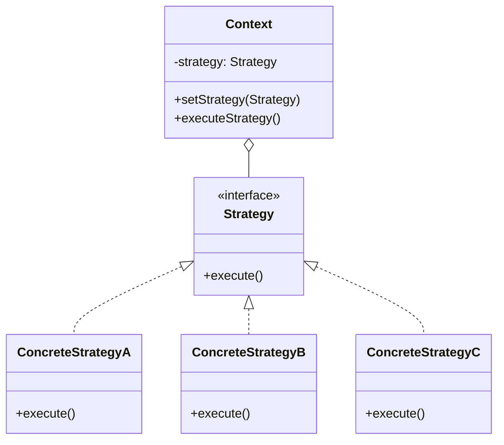
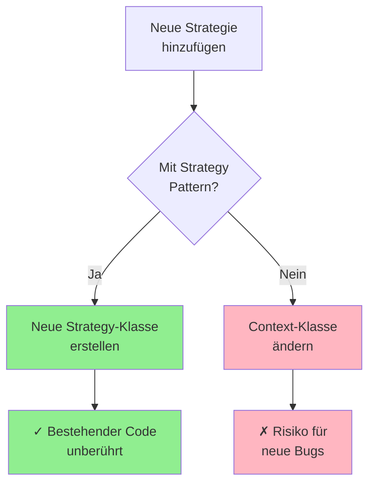
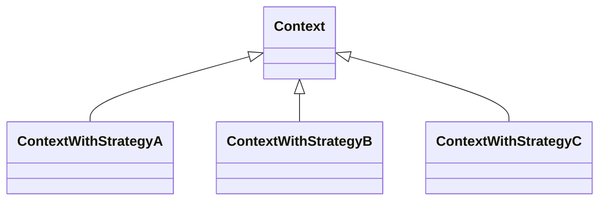
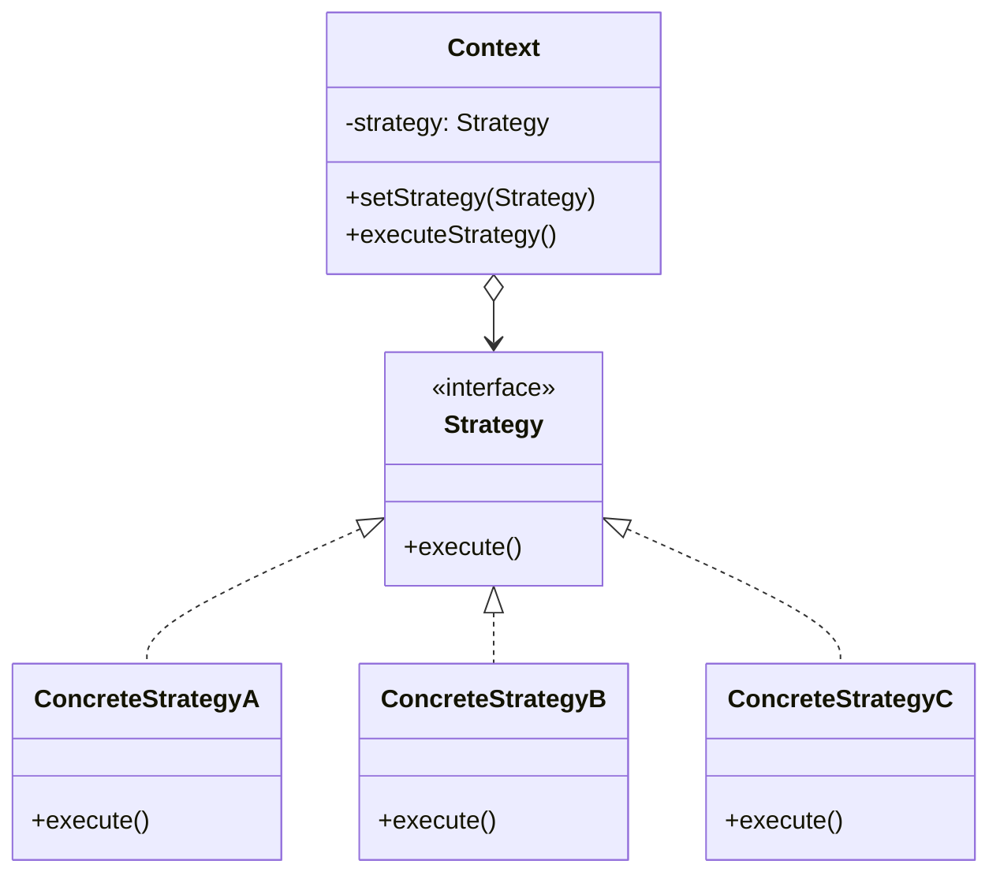

## Was ist das Strategy Pattern?

Das **Strategy Pattern** ist ein Verhaltensmuster, das eine Familie von Algorithmen definiert, diese in separate Klassen kapselt und austauschbar macht.

### Kernidee

Anstatt ein Verhalten in einer Klasse zu implementieren, wird es in separate Strategieklassen ausgelagert, die zur Laufzeit ausgetauscht werden können.

## Struktur des Strategy Patterns



### Komponenten

1. **Strategy (Interface/abstrakte Klasse)**: Definiert gemeinsame Schnittstelle für alle Algorithmen
2. **ConcreteStrategy**: Konkrete Implementierungen der Algorithmen
3. **Context**: Verwendet eine Strategy und kann diese wechseln


## Vorteile des Strategy Patterns

- Keine Code-Duplizierung:  Verhalten wird nur einmal implementiert
- Zur Laufzeit änderbar: Verhalten kann dynamisch gewechselt werden
- Leicht erweiterbar: Neue Strategien hinzufügen ohne bestehenden Code zu ändern
- Gut testbar: Jede Strategie kann isoliert getestet werden
- Wiederverwendbar: Strategien können von verschiedenen Klassen genutzt werden
- Open/Closed Principle: Offen für Erweiterung, geschlossen für Änderung
- Vermeidet komplexe Conditionals: Keine langen if-else oder switch-case Ketten
- Klare Trennung: Algorithmen sind von der Verwendung getrennt

## Design Principles

### Open-Closed Principle

>Offen für Erweiterung, geschlossen für Änderung

**Mit Strategy Pattern:**

- Neue Strategie hinzufügen → Neue Klasse erstellen
- Bestehender Code bleibt unverändert
- Kein Risiko, Bugs in funktionierenden Code einzuführen

**Ohne Strategy Pattern:**

- Neue Funktionalität → Bestehende Klasse ändern
- Risiko: Bestehende Funktionalität kaputt machen
- if-else/switch-case Ketten wachsen




### Dependency Inversion Principle

>Abhängigkeit von Abstraktionen, nicht von Konkretionen

**Gut - Abhängigkeit vom Interface:**

```java
class Context {
    private Strategy strategy;  
}
```

**Schlecht - Abhängigkeit von konkreter Klasse:**

```java
class Context {
    private ConcreteStrategyA strategy;
}
```

**Vorteil:** Context kennt nur das Interface, nicht die konkrete Implementierung

### Composition over Inheritance

>Verhalten durch Komposition statt Vererbung

#### Schlechter Ansatz: Nur Vererbung



**Probleme:**

- Verhalten nicht zur Laufzeit änderbar
- Klassenexplosion bei vielen Kombinationen
- Statisch und unflexibel

#### Guter Ansatz: Komposition mit Strategy Pattern



**Vorteile:**

- Verhalten zur Laufzeit änderbar
- Nur eine Context-Klasse nötig
- Flexibel und erweiterbar

### Encapsulate What Varies

>Trenne was sich ändert von dem was gleich bleibt

**Was variiert:** Die Strategie (Algorithmus, Verhalten) 
**Was konstant bleibt:** Der Context (Verwendung)

```java
// Variiert - in eigenen Klassen gekapselt
interface Strategy { void execute(); }
class StrategyA implements Strategy { ... }
class StrategyB implements Strategy { ... }

// Bleibt konstant
class Context {
    private Strategy strategy;
    public void doSomething() {
        strategy.execute();  // Immer gleicher Aufruf
    }
}
```

### Program to Interface, Not Implementation

>Programmiere gegen Schnittstellen, nicht gegen Implementierungen

```java
// Gut - gegen Interface programmiert
Strategy strategy = new ConcreteStrategyA();

// Schlecht - gegen konkrete Klasse programmiert
ConcreteStrategyA strategy = new ConcreteStrategyA();
```

**Vorteil:** Strategie kann leicht ausgetauscht werden

## Testen ist einfacher mit Strategy Pattern (zum Mocken)

Das Strategy Pattern macht Code testbar, indem es einen **Seam** (Nahtstelle) schafft, an dem echte Implementierungen durch Test-Doubles ersetzt werden können.

### Warum ist das wichtig?

Ohne Strategy Pattern wäre `UserRegistration` direkt an `RealEmailService` gekoppelt:

```java
class UserRegistration {
    public void register(User user) {
        RealEmailService email = new RealEmailService();  // Hart kodiert!
        email.send(user.getEmail(), "Welcome!");
    }
}
```

**Problem:** Jeder Test sendet echte Emails dh. langsam, teuer, unzuverlässig.

### Die Lösung: Strategy als Mock-Interface

Mit Strategy Pattern wird die Abhängigkeit injiziert:

```java
class UserRegistration {
    private EmailService emailService;  // Interface!
    
    public UserRegistration(EmailService emailService) {
        setEmailService(emailService);  // Dependency Injection
    }
}
```

**Im Test:** Setze eine Mock-Implementierung ein, die nichts tut außer aufzuzeichnen, dass sie aufgerufen wurde.

### Vorteile für Tests

1. **Schnell**: Keine echten externen Aufrufe (keine SMTP-Verbindung)
2. **Kontrolliert**: Mock gibt zurück, was du brauchst
3. **Isoliert**: Nur die Business-Logik wird getestet, nicht der Email-Versand
4. **Verifizierbar**: Kann prüfen, ob und wie die Strategie aufgerufen wurde

Das Strategy Interface dient als **natürlicher Seam** für Dependency Injection und ermöglicht so testbaren Code ohne zusätzlichen Aufwand.

```java
@Test
void testRegistrationSendsEmail() {
    // Verwendet die Mock Strategy
    MockEmailService mockEmail = new MockEmailService();
    UserRegistration reg = new UserRegistration(mockEmail);
    
    reg.register(new User("test@example.com"));
    
    assertTrue(mockEmail.emailSent);  // Keine echte Email
}
```